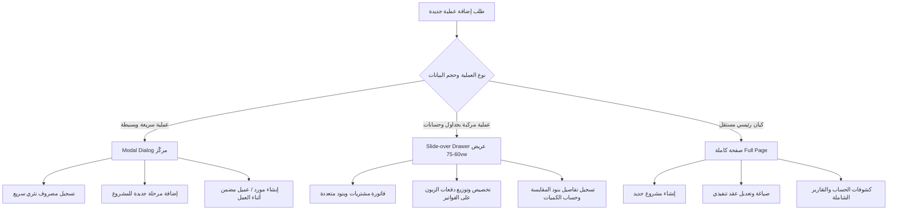

# تقرير التدقيق الشامل لتجربة الاستخدام والمسارات وهيكل المنظومة (UX / UI / Navigation Audit)
## منظومة ركاز / الفارس الذهبي لإدارة المقاولات والتشطيبات

> **نوع الوثيقة:** تدقيق تفصيلي وتحليلي عميق (Audit & Analysis Report Only)  
> **حالة النظام:** مرحلة ما قبل إعادة الهيكلة والتصميم (Pre-Redesign)  
> **النطاق:** فحص كامل مسارات النظام (Routes, Sidebar, Header, Workflows, Project Workspace, Financials, Modals, RTL, Roles, State, Query Keys).

---

## فهرس التقرير الشامل

1. [Current Information Architecture Map](#1-current-information-architecture-map)
2. [Full Route Map](#2-full-route-map)
3. [Sidebar Map & Taxonomy](#3-sidebar-map--taxonomy)
4. [Project Workspace Map](#4-project-workspace-map)
5. [Project Switching Analysis & Risks](#5-project-switching-analysis--risks)
6. [Current Context & Mental Model Analysis](#6-current-context--mental-model-analysis)
7. [Add / Edit Workflow Analysis](#7-add--edit-workflow-analysis)
8. [Nested Entity Creation & Missing In-Flight Workflows](#8-nested-entity-creation--missing-in-flight-workflows)
9. [Global vs Project-Level Feature Matrix](#9-global-vs-project-level-feature-matrix)
10. [Navigation Problems & Dead Ends](#10-navigation-problems--dead-ends)
11. [Back Button, Breadcrumbs & History Problems](#11-back-button-breadcrumbs--history-problems)
12. [Search & Selection UX Problems](#12-search--selection-ux-problems)
13. [Table & List UX Problems](#13-table--list-ux-problems)
14. [Form UX & Input Friction](#14-form-ux--input-friction)
15. [Dialog / Modal / Drawer / Page Decision Analysis](#15-dialog--modal--drawer--page-decision-analysis)
16. [Error Handling & Feedback UX](#16-error-handling--feedback-ux)
17. [Loading, Skeletons & Layout Shifts](#17-loading-skeletons--layout-shifts)
18. [RTL & Arabic Interface Compliance](#18-rtl--arabic-interface-compliance)
19. [Responsive & Screen Density UX](#19-responsive--screen-density-ux)
20. [Accessibility & Keyboard Navigation](#20-accessibility--keyboard-navigation)
21. [Role & Permission UX Adaptability](#21-role--permission-ux-adaptability)
22. [Current Workflow Click Counts & Backtracks](#22-current-workflow-click-counts--backtracks)
23. [Cross-Project Data Leakage Risk Analysis](#23-cross-project-data-leakage-risk-analysis)
24. [الإجابة التفصيلية الموثقة على الأسئلة الجوهرية (الأقسام A إلى Z)](#24-answers-to-audit-questions-sections-a-to-z)
25. [مصفوفة نتائج التدقيق التفصيلية (Structured Findings Matrix)](#25-structured-findings-matrix)
26. [أكبر 10 مشاكل UX حالية](#26-top-10-ux-problems)
27. [أكبر 10 مشاكل Navigation وتوجيه](#27-top-10-navigation-problems)
28. [أكبر 10 عوائق ومصادر بطء في مسارات العمل (Workflow Frictions)](#28-top-10-workflow-frictions)
29. [أهم 10 مكاسب سريعة فورية (Quick Wins)](#29-top-10-quick-wins)
30. [Proposed Ideal Information Architecture](#30-proposed-ideal-information-architecture)
31. [Proposed Ideal Project Workspace](#31-proposed-ideal-project-workspace)
32. [Proposed Project Switcher & Header Quick Actions](#32-proposed-project-switcher--header-quick-actions)
33. [Proposed Add / Create Architecture (Modal vs Drawer vs Page)](#33-proposed-add--create-architecture)
34. [Proposed UX Priorities & Rebuild Roadmap](#34-proposed-ux-priorities--rebuild-roadmap)

---

## 1. Current Information Architecture Map

تتوزع بنية المعلومات الحالية في النظام عبر هيكل يعتمد على الجداول التخزينية (Database Schema-Centric) أكثر من كونه مصمماً وفق دورة حياة المشروع الواقعية (Project Lifecycle Centric).

```mermaid
graph TD
  App[منظومة ركاز]
  
  App --> Sidebar[الشريط الجانبي Global Sidebar - 29 بنداً]
  App --> Header[الترويسة Global Header - بحث وهمي + إشعارات]
  
  Sidebar --> G_Main[الرئيسية: لوحة التحكم | المالية | مقاولات | تشطيبات | حركات الزبائن]
  Sidebar --> G_Ops[العمليات: البنود العامة | المعدات | الإيجارات | المخازن]
  Sidebar --> G_People[الأشخاص: العملاء | الموردون | الفنيون | المهندسون | الموظفون]
  Sidebar --> G_Finance[المالية: مصروفات المشاريع | مركز الفواتير | الخزائن | إيصالات الزبائن | الديون | الدخول والخروج | المصروفات]
  Sidebar --> G_System[النظام: التقارير | النسخ الاحتياطي | سجل التعديلات | المستخدمون | التقويم | الإعدادات | تصميم الطباعة | قوالب العقود]

  App --> ProjectSpace[مساحة المشروع Project Workspace]
  ProjectSpace --> PhaseView[فواتير المراحل ProjectPhases.tsx]
  PhaseView --> Sub_Items[بنود المقاولات]
  PhaseView --> Sub_Purchases[فواتير المشتريات والخدمات]
  PhaseView --> Sub_Rentals[إيجارات المعدات]
  PhaseView --> Sub_Expenses[مصروفات المرحلة]
  ProjectSpace --> Global_Project_Contracts[عقود المشروع]
  ProjectSpace --> Global_Project_Payments[تسديدات الزبون وتوزيعها]
  ProjectSpace --> Global_Project_Report[تقرير المشروع والطباعة]
```

### الخلل المعماري الأساسي:
1. **تشتت إدارة المشروع**: مساحة المشروع منقسمة بين صفحات بمستوى المشروع (`/projects/:id/...`) وصفحات فرعية بمستوى المرحلة (`/projects/:id/phases/:phaseId/...`)، مع غياب صفحة رئيسية موحدة للمشروع (Project Overview Hub).
2. **ازدواجية الشاشات المالية والعملياتية**: توجد شاشات عامة للمشتريات والمصروفات والفواتير في الشريط الجانبي وشاشات مكررة مطابقة داخل كل مرحلة ومشروع، دون تكامل في الفلاتر أو الحفاظ على السياق.

---

## 2. Full Route Map

يحتوي ملف `src/App.tsx` على **39 مساراً رئيسياً وفرعياً** داخل الإطار المحمي `ProtectedRoute`:

| # | المسار (Route Path) | المكون المسؤول (Component) | نوع المسار | الوظيفة وسياق الاستخدام |
|---|--------------------|----------------------------|------------|-------------------------|
| 1 | `/` | `Dashboard.tsx` | Global | لوحة التحكم العامة والإحصائيات |
| 2 | `/accountant` | `AccountantDashboard.tsx` | Global | لوحة التحكم المالية للمحاسب |
| 3 | `/projects` | `Projects.tsx` | Global Index | دليل كافة المشاريع |
| 4 | `/projects/contracting` | `Projects.tsx (type="contracting")` | Global Index | مشاريع المقاولات فقط |
| 5 | `/projects/finishing` | `Projects.tsx (type="finishing")` | Global Index | مشاريع التشطيبات فقط |
| 6 | `/projects/client/:clientId` | `ClientProjects.tsx` | Filtered Index | مشاريع عميل محدد |
| 7 | `/projects/new` | `ManageProject.tsx` | Action | نموذج إنشاء مشروع جديد |
| 8 | `/projects/:id` | `ManageProject.tsx` | Project Workspace | نموذج تعديل المشروع |
| 9 | `/projects/:id/edit` | `ManageProject.tsx` | Project Workspace | شاشة إعدادات المشروع |
| 10 | `/projects/:id/phases` | `ProjectPhases.tsx` | Project Workspace | إدارة فواتير ومراحل المشروع (نقطة الدخول الحالية) |
| 11 | `/projects/:id/items` | `ProjectItems.tsx` | Project Workspace | بنود المقاولات على مستوى المشروع |
| 12 | `/projects/:id/purchases` | `ProjectPurchases.tsx` | Project Workspace | مشتريات المشروع |
| 13 | `/projects/:id/progress` | `ProjectProgress.tsx` | Project Workspace | نسب الإنجاز للمشروع |
| 14 | `/projects/:id/report` | `ProjectReport.tsx` | Project Workspace | التقرير المالي الشامل للمشروع |
| 15 | `/projects/:id/equipment` | `ProjectEquipmentRentals.tsx` | Project Workspace | إيجارات معدات المشروع |
| 16 | `/projects/:id/expenses` | `ProjectExpenses.tsx` | Project Workspace | مصروفات المشروع |
| 17 | `/projects/:id/contracts` | `ProjectContracts.tsx` | Project Workspace | عقود المشروع |
| 18 | `/projects/:id/payments` | `ProjectPayments.tsx` | Project Workspace | دفعات الزبون المخصصة للمشروع |
| 19 | `/projects/:id/phases/:phaseId/items` | `ProjectItems.tsx` | Phase Workspace | بنود مقاولات مرحلة معينة |
| 20 | `/projects/:id/phases/:phaseId/purchases` | `ProjectPurchases.tsx` | Phase Workspace | مشتريات مرحلة معينة |
| 21 | `/projects/:id/phases/:phaseId/expenses` | `ProjectExpenses.tsx` | Phase Workspace | مصروفات مرحلة معينة |
| 22 | `/projects/:id/phases/:phaseId/equipment` | `ProjectEquipmentRentals.tsx` | Phase Workspace | إيجارات معدات مرحلة معينة |
| 23 | `/client-payments` | `ClientPayments.tsx` | Global Directory | سجل إيصالات ومقبوضات الزبائن وتوزيعها |
| 24 | `/rentals` | `ProjectsWithRentals.tsx` | Global Directory | دليل إيجارات المشاريع |
| 25 | `/project-expenses` | `AllProjectExpenses.tsx` | Global Directory | سجل مصروفات المشاريع العامة |
| 26 | `/custody` | `Custody.tsx` | Global Directory | عهد الموظفين والمشاريع |
| 27 | `/custody/:id` | `CustodyDetail.tsx` | Detail View | تفاصيل عهدة معينة |
| 28 | `/employees` | `Employees.tsx` | Global Directory | شؤون الموظفين والرواتب |
| 29 | `/general-items` | `GeneralItems.tsx` | Global Settings | البنود العامة والقوالب |
| 30 | `/measurement-types` | `MeasurementTypes.tsx` | Global Settings | أنواع ووحدات القياس |
| 31 | `/equipment` | `Equipment.tsx` | Global Directory | سجل المعدات والآليات |
| 32 | `/equipment/:id` | `EquipmentDetail.tsx` | Detail View | تفاصيل وسجل معدة معينة |
| 33 | `/contracts` | `Contracts.tsx` | Global Directory | سجل العقود العام |
| 34 | `/contracts/new` | `CreateContract.tsx` | Action | إنشاء عقد جديد |
| 35 | `/contracts/:id` | `CreateContract.tsx` | Detail / Edit | تعديل عقد محدد |
| 36 | `/clients` | `Clients.tsx` | Global Directory | دليل العملاء |
| 37 | `/clients/:id` | `ClientDetail.tsx` | Detail View | ملف العميل الشامل (مشاريع، دفعات، كشف حساب) |
| 38 | `/debts` | `Debts.tsx` | Global Financial | ديون وذمم الزبائن |
| 39 | `/suppliers` | `Suppliers.tsx` | Global Directory | دليل الموردين |
| 40 | `/suppliers/:id` | `SupplierDetail.tsx` | Detail View | كشف حساب المورد والمشاريع المرتبطة |
| 41 | `/technicians` | `Technicians.tsx` | Global Directory | دليل الفنيين والعمالة |
| 42 | `/technicians/:id` | `TechnicianDetail.tsx` | Detail View | كشف حساب الفني والإنجازات |
| 43 | `/engineers` | `Engineers.tsx` | Global Directory | دليل المهندسين المشرفين |
| 44 | `/engineers/:id` | `EngineerDetail.tsx` | Detail View | ملف المهندس والمشاريع المشرف عليها |
| 45 | `/income` | `Income.tsx` | Global Financial | الإيرادات الأخرى |
| 46 | `/expenses` | `Expenses.tsx` | Global Financial | المصروفات العامة (الخروج) |
| 47 | `/transfers` | `Transfers.tsx` | Global Financial | التحويلات بين الخزائن (الدخول والخروج) |
| 48 | `/treasuries` | `Treasuries.tsx` | Global Financial | خزائن الشركة وحساباتها |
| 49 | `/treasuries/:id` | `TreasuryDetail.tsx` | Detail View | كشف حركات خزينة محددة |
| 50 | `/client-activities` | `ClientActivities.tsx` | Global Log | سجل حركات الزبائن التاريخي |
| 51 | `/invoice-control` | `InvoiceControl.tsx` | Global Financial | مركز الفواتير والرقابة عليها |
| 52 | `/reports` | `Reports.tsx` | Global Reports | منظومة التقارير المالية والتشغيلية |
| 53 | `/database-backup` | `DatabaseBackup.tsx` | System | النسخ الاحتياطي لقاعدة البيانات |
| 54 | `/audit-log` | `AuditLog.tsx` | System | سجل الرقابة وتتبع التعديلات |
| 55 | `/users` | `UserManagement.tsx` | System | إدارة المستخدمين والصلاحيات |
| 56 | `/calendar` | `CalendarPage.tsx` | System | التقويم الزمني |
| 57 | `/settings` | `Settings.tsx` | System | إعدادات الشركة العامة |
| 58 | `/print-design` | `PrintDesign.tsx` | System | مصمم قوالب الطباعة |
| 59 | `/contract-templates` | `ContractClauseTemplates.tsx` | System | قوالب بنود وشروط العقود |
| 60 | `/inventory` | `Inventory.tsx` | Operations | المخازن والمواد |

---

## 3. Sidebar Map & Taxonomy

يحتوي الشريط الجانبي في `src/pages/Index.tsx` على **5 مجموعات تضم 29 رابطاً مستقلاً**، مما يُحدث إرهاقاً بصرياً (Cognitive Overload) ويصعب بناء نموذج ذهني واضح لمستخدم النظام.

```
[الشريط الجانبي الحالي - 29 عنصراً]
├── 1. الرئيسية (5 عناصر)
│   ├── لوحة التحكم (/)
│   ├── لوحة التحكم المالية (/accountant)
│   ├── مشاريع المقاولات (/projects/contracting)
│   ├── مشاريع التشطيبات (/projects/finishing)
│   └── سجل حركات الزبائن (/client-activities)
├── 2. العمليات (4 عناصر)
│   ├── البنود العامة (/general-items)
│   ├── المعدات (/equipment)
│   ├── إيجارات المشاريع (/rentals)
│   └── المخازن (/inventory)
├── 3. الأشخاص (5 عناصر)
│   ├── العملاء (/clients)
│   ├── الموردون (/suppliers)
│   ├── الفنيون (/technicians)
│   ├── المهندسون (/engineers)
│   └── الموظفين (/employees)
├── 4. المالية (7 عناصر)
│   ├── مصروفات المشاريع (/project-expenses)
│   ├── مركز الفواتير (/invoice-control)
│   ├── خزائن الشركة (/treasuries)
│   ├── إيصالات مقبوضات الزبائن (/client-payments)
│   ├── ديون وذمم الزبائن (/debts)
│   ├── الدخول والخروج (/transfers)
│   └── الخروج (/expenses)
└── 5. النظام (8 عناصر)
    ├── التقارير (/reports)
    ├── النسخ الاحتياطي (/database-backup)
    ├── سجل التعديلات (/audit-log)
    ├── المستخدمون (/users)
    ├── التقويم (/calendar)
    ├── الإعدادات (/settings)
    ├── تصميم الطباعة (/print-design)
    └── قوالب العقود (/contract-templates)
```

---

## 4. Project Workspace Map

عندما يفتح المستخدم مشروعاً معيناً، يتنقل عبر شريط التنقل `ProjectNavBar.tsx`. الهيكل الحالي يعتمد على حالتين منفصلتين:

### الحالة 1: تصفح المشروع العام (دون تحديد مرحلة)
- **المسار:** `/projects/:id/phases`
- **التبويبات المتاحة في `ProjectNavBar`:**
  1. `المراحل` (`/projects/:id/phases`)
  2. `العقود` (`/projects/:id/contracts`)
  3. أزرار علوية: `طباعة التقرير` (`/projects/:id/report`)، `إعدادات` (`/projects/:id/edit`).
- **المشكلة:** يختفي تبويب "تسديدات الزبون" (`/projects/:id/payments`) و"المصروفات" و"المشتريات" العامة من التبويبات العلوية، بالرغم من وجود كود لهذه الصفحات في المسارات.

### الحالة 2: تصفح مرحلة محددة (Phase View)
- **المسار:** `/projects/:id/phases/:phaseId/...`
- **التبويبات المتاحة في `ProjectNavBar`:**
  1. `البنود` (`/projects/:id/phases/:phaseId/items`) [تختفي في مشاريع التشطيبات]
  2. `نسب الإنجاز` (`/projects/:id/phases/:phaseId/progress`)
  3. `المشتريات` (`/projects/:id/phases/:phaseId/purchases`)
  4. `المصروفات` (`/projects/:id/phases/:phaseId/expenses`)
  5. `العقود` (`/projects/:id/phases/:phaseId/contracts`)
  6. `المعدات` (`/projects/:id/phases/:phaseId/equipment`)

---

## 5. Project Switching Analysis & Risks

### كم خطوة يحتاجها المستخدم للانتقال من مشروع A إلى مشروع B؟
- **الوضع الحالي:**
  1. الضغط على زر الرجوع أو الضغط على "المشاريع" في الشريط الجانبي أو فتات الخبز.
  2. التمرير أو البحث في قائمة المشاريع عن المشروع B.
  3. النقر على بطاقة المشروع B (التي تفتحه تلقائياً في صفحة المراحل `/phases`).
  4. إعادة الدخول إلى المرحلة المطلوبة والضغط على تبويب "المشتريات" للوصول لنفس شاشة العمل.
  - **الإجمالي:** 4 إلى 5 خطوات مع فقدان كامل لسياق الصفحة المفتوحة.

### فحص مفاتيح React Query Key:
- تم فحص استعلامات المشروع ووجد الآتي:
  - `queryKey: ["project-phases", projectId]`
  - `queryKey: ["project-purchases", projectId, phaseId]`
  - `queryKey: ["project-items", projectId, phaseId]`
  - `queryKey: ["project-client-payments", projectId]`
- **النتيجة:** المفاتيح تحتوي على `projectId` و `phaseId`، مما يمنع تداخل الـ Cache التلقائي، لكن النماذج المفتوحة في الـ Dialogs تحتفظ بالحالة السابقة في الـ Local React State إذا لم تتم إعادة ضبطها عند التغيير.

---

## 6. Current Context & Mental Model Analysis

### فحص الترويسة وفتات الخبز (Header & Breadcrumbs):
1. **الترويسة العامة (`Header.tsx`):**
   - تحتوي على حقل إدخال بحث نصي غير متصل بأي منطق برمجي (`placeholder="بحث..."` بدون `onChange` أو معالجة)، مما يعطي انطباعاً خادعاً بوجود بحث عام فعال.
   - لا تعرض اسم المشروع المفتوح حالياً إطلاقاً.
   - لا تحتوي على محول مشاريع (Project Switcher) سريع.
2. **شريط المشروع (`ProjectNavBar.tsx`):**
   - يعرض مسار فتات الخبز: `المشاريع > [اسم العميل] > [اسم المشروع] > [اسم المرحلة]`.
   - المشكلة: فتات الخبز موضوع داخل المكون الداخلي للمشروع وليس في الترويسة الثابتة، مما يجعله يختفي أو يبتعد عند التمرير لأسفل في الجداول الطويلة.

---

## 7. Add / Edit Workflow Analysis

| الكيان المراد إضافته | مكان زر الإضافة | نمط الواجهة المستخدم | التغذية الراجعة بعد الحفظ | هل يُفقد العمل عند النقر بالخطأ بالخارج؟ |
|---|---|---|---|---|
| **مشروع جديد** | أعلى جدول المشاريع | صفحة كاملة (`/projects/new`) | رسالة Toast + انتقال لقائمة المشاريع | لا (صفحة كاملة مع نموذج مخصص) |
| **فاتورة مرحلة** | أعلى قائمة المراحل | Dialog منبثق | رسالة Toast + إغلاق الـ Dialog | **نعم** (إغلاق فوري دون تحذير) |
| **بند مقاولات** | أعلى جدول البنود | نموذج مدمج أعلى الجدول (Inline Card) | مسح الحقول + تحديث الجدول | لا (مدمج في الصفحة) |
| **فاتورة مشتريات** | أعلى جدول المشتريات | Dialog منبثق ضخم (أكثر من 800 سطر كود) | Toast + إغلاق Dialog | **نعم** (النموذج يغلق وتفقد بيانات البنود) |
| **إيجار معدة** | أعلى جدول الإيجارات | Dialog منبثق | Toast + إغلاق Dialog | **نعم** |
| **مصروف مشروع** | أعلى جدول المصروفات | Dialog منبثق | Toast + إغلاق Dialog | **نعم** |
| **دفعة عميل** | أعلى صفحة الدفعات | Dialog تخصيص مركب مع جدول فواتير | Toast + إغلاق Dialog | **نعم** |
| **عقد جديد** | أعلى جدول العقود | صفحة كاملة (`/contracts/new`) | Toast + توجيه لجدول العقود | لا |

---

## 8. Nested Entity Creation & Missing In-Flight Workflows

### السيناريو الواقعي اليومي:
المستخدم يفتح نموذج تسجيل فاتورة مشتريات (`ProjectPurchases.tsx`)، وعند فتح القائمة المنسدلة للموردين يكتشف أن **المورد جديد وغير مسجل**:
1. **الوضع الحالي في الكود:** القائمة المنسدلة هي مكون `<Select>` تقليدي يقرأ من جدول `suppliers`.
2. **المسار الإجباري المرهق للمستخدم:**
   - يضطر لإغلاق الـ Dialog (وفقدان كل ما كتبه من أسعار وبنود وتواريخ).
   - الخروج من المشروع والذهاب إلى قائمة "الموردون" في الشريط الجانبي.
   - النقر على "إضافة مورد جديد" وتعبئة البيانات وحفظه.
   - العودة للمشاريع -> اختيار المشروع -> اختيار المرحلة -> اختيار المشتريات -> فتح نافذة الإضافة من الصفر!
3. **الأثر:** تجربة مستخدم شديدة الإحباط ومضيعة للوقت (تتطلب أكثر من 8 خطوات و3 شاشات مختلفة).

---

## 9. Global vs Project-Level Feature Matrix

يوضح الجدول التالي التناقض الحالي في توزيع الوظائف بين المستوى العام ومستوى مساحة المشروع:

| الوظيفة / الكيان | مكانها الحالي في الشريط الجانبي (Global) | مكانها داخل المشروع (Project Workspace) | التقييم والتوصية الهيكلية |
|---|---|---|---|
| **فواتير المشتريات** | موجودة داخل "مركز الفواتير" و"الموردين" | موجودة داخل كل مرحلة ومشروع | يجب أن تكون إدارة المشتريات متمركزة داخل المشروع (Project-Centric)، مع بقاء مركز الفواتير كأداة رقابية مالية فقط. |
| **المصروفات** | موجودة باسمين: "مصروفات المشاريع" و"الخروج" | موجودة داخل كل مرحلة ومشروع | دمج "مصروفات المشاريع" و"الخروج" في شاشة مالية واحدة عالمياً، وجعل الإدخال اليومي من داخل مساحة المشروع. |
| **إيجارات المعدات** | موجودة باسم "إيجارات المشاريع" و"المعدات" | موجودة كـ Tab داخل المرحلة | شاشة "المعدات" تظل دليلاً للأصول، بينما تسجيل الإيجارات يتبع المشروع. |
| **تسديدات الزبائن** | موجودة كـ "إيصالات مقبوضات الزبائن" و"سجل حركات الزبائن" | موجودة في `ProjectPayments.tsx` ولكن مهملة الرابط في التبويبات | توحيد شاشة الإيصالات مع كشف حركات الزبائن، وجعل التخصيص واضحاً داخل المشروع. |
| **العقود** | موجودة في "العقود" وقوالب العقود | موجودة داخل `ProjectContracts.tsx` | قوالب العقود تظل في الإعدادات، والعقود التنفيذية تُدار من داخل المشروع. |
| **العهد** | موجودة في "العهد" وموجودة كـ `ProjectCustody.tsx` | غير مربوطة في شريط المشروع | العهد مرتبطة بالموظف والمهندس ومخصصة للمشاريع. |

---

## 10. Navigation Problems & Dead Ends

1. **البحث الوهمي في الترويسة الرئيسية (`src/components/layout/Header.tsx`):**  
   حقل البحث في أعلى النظام لا يقوم بأي وظيفة، ولا يفتح Command Palette، مما يربك المستخدم.
2. **انعدام زر العودة الموحد في الشاشات العميقة:**  
   صفحات مثل `CustodyDetail.tsx` و `Settings.tsx` تستخدم `navigate(-1)` العميقة، والتي إذا فتحها المستخدم من رابط مباشر أو إشعار تعيده إلى صفحة بيضاء أو صفحة تسجيل الدخول.
3. **تشتت الدخول إلى المشروع:**  
   النقر على المشروع من لوحة التحكم ينقل المستخدم إلى `/projects/:id` (شاشة التعديل)، بينما النقر عليه من قائمة المشاريع ينقله إلى `/projects/:id/phases` (شاشة المراحل).

---

## 11. Back Button, Breadcrumbs & History Problems

### فحص كود اتجاهات الأيقونات والرجوع:
- **اكتشاف خلل في اتجاه الأيقونات:**  
  في ملفات مثل `ClientDetail.tsx` (سطر 1017)، `ClientProjects.tsx` (سطر 166)، و `SupplierDetail.tsx` (سطر 772):
  تم استخدام:
  ```tsx
  <ArrowRight className="h-4 w-4 rotate-180" />
  ```
  هذا التدوير اليدوي يعكس اتجاه السهم في بيئة RTL ليصبح مشيراً لليسار (وهو اتجاه "الأمام" في العربية وليس "الرجوع")، مما ينتهك قواعد الـ RTL المعتمدة للمشروع.
- **فقدان حالة التصفية والبحث (Filter State Loss):**  
  عندما يقوم المستخدم بتصفية قائمة المشاريع أو العملاء بالبحث عن اسم معين، ثم يدخل إلى تفاصيل أحد السجلات ويضغط زر الرجوع، يتم تفريغ حقل البحث وإعادة تحميل القائمة من الصفحة الأولى.

---

## 12. Search & Selection UX Problems

1. **استخدام القوائم المنسدلة العادية (`Select`) للبيانات الضخمة:**  
   في `ManageProject.tsx` و `ProjectPurchases.tsx` و `ClientPayments.tsx`، يتم عرض العملاء والموردين والخزائن باستخدام `<Select>` بدون إمكانية البحث بالكتابة (Searchable Combobox). عند وصول عدد الموردين إلى 200+ مورد، يصبح اختيار المورد عملية شاقة جداً.
2. **غياب معلومات التمييز في القوائم:**  
   تعرض قوائم العملاء والموردين الأسماء فقط، دون إظهار رقم الهاتف أو المدينة أو الكود للتمييز بين الأسماء المتشابهة.

---

## 13. Table & List UX Problems

1. **كثافة الأعمدة واختفاء البيانات المهمة:**  
   جدول المشتريات وجدول بنود المقاولات يحتويان على عدد كبير من الأعمدة دون إمكانية إخفاء/إظهار الأعمدة أو التمرير الأفقي المحكوم.
2. **حالات الفراغ (Empty States):**  
   معظم الجداول تعرض نصوصاً جافة مثل "لا توجد بيانات" أو أيقونة باهتة دون توجيه عملي واضح (Call to Action) يشجع المستخدم على إضافة السجل الأول.

---

## 14. Form UX & Input Friction

1. **تراكم النماذج الطويلة داخل نوافذ منبثقة ضيقة (Modal Scrolling):**  
   نموذج إضافة فاتورة المشتريات ونموذج تخصيص الدفعات يحتويان على جداول وتفريعات فرعية داخل Dialog صغير، مما يخلق شريط تمرير داخلي مزدوج (Double Scrollbar) مزعج للمستخدم.
2. **غياب الحماية من فقدان البيانات (Unsaved Changes Warning):**  
   أي نقرة غير مقصودة خارج الـ Modal أو ضغط مفتاح Escape تؤدي لإغلاق النموذج ومسح كل البيانات المدخلة فوراً دون أي تحذير تأكيدي.
3. **غياب المقارنة المالية اللحظية (Before / After Financial Impact):**  
   عند إدخال دفعة للمورد أو الزبون، لا يعرض النموذج ملخصاً واضحاً لـ (الرصيد السابق -> المبلغ المدفوع -> الرصيد المتبقي بعد العملية) قبل الضغط على حفظ.

---

## 15. Dialog / Modal / Drawer / Page Decision Analysis

| الشاشة / العملية | النمط الحالي | التقييم | النمط الموصى به لإعادة البناء |
|---|---|---|---|
| **إضافة / تعديل فاتورة مشتريات** | Dialog منبثق | سيئ جداً (النموذج طويل ويحتوي تفاصيل بنود وأسعار وخزينة) | **Slide-over Drawer** عريض أو صفحة كاملة |
| **تخصيص وتوزيع دفعات الزبائن** | Dialog منبثق | سيئ (يحتوي جدول فواتير ومطابقات ونسب) | **Slide-over Drawer** عريض جداً (75vw) |
| **إضافة مشروع جديد** | صفحة كاملة | ممتاز ومريح | **Full Page** (مع الحفاظ على التبسيط) |
| **إضافة مرحلة / فاتورة مرحلة** | Dialog منبثق | مناسب | **Standard Dialog** صغير وسريع |
| **تسجيل مصروف نثري سريع** | Dialog منبثق | ممتاز | **Standard Dialog** مع تحسين اختيار الخزينة |
| **إنشاء عقد وصياغة البنود** | صفحة كاملة | ممتاز | **Full Page** مع تحسين واجهة المعاينة والطباعة |

---

## 16. Error Handling & Feedback UX

1. **غموض رسائل الأخطاء القادمة من قاعدة البيانات:**  
   في عدة مواضع بالنماذج، عند فشل الإدخال (بسبب قيد أجنبي Foreign Key أو عدم كفاية رصيد الخزينة)، يظهر Toast عام يحتوي نص الخطأ التقني بالإنجليزية أو رسالة "حدث خطأ أثناء الحفظ" دون توضيح السبب الحقيقي والحل المطلوب للمستخدم.
2. **منع النقر المزدوج (Double Submit Prevention):**  
   بعض أزرار الحفظ لا تعطل مؤشر الفأرة فوراً أثناء انتظار استجابة الشبكة (Mutation Pending)، مما قد يؤدي لإرسال الدفعة أو الفاتورة مرتين في حال بطء الاتصال.

---

## 17. Loading, Skeletons & Layout Shifts

1. **التباين في مؤشرات التحميل:**  
   تستخدم بعض الصفحات مؤشرات هيكلية أنيقة (Skeletons مثل `Dashboard.tsx`)، بينما تستخدم صفحات رئيسية أخرى دوائر دوارة بدائية (Spinners في وسط الصفحة مثل `ManageProject.tsx` و `Projects.tsx`)، مما يتسبب في انزياح بصري مفاجئ (Layout Shift) عند ظهور المحتوى.

---

## 18. RTL & Arabic Interface Compliance

1. **محاذاة الأيقونات والمسافات:**  
   المنظومة مصممة بـ RTL أساسي، لكن يوجد استخدام متكرر لكلاسات يدوية مثل `ml-2` و `mr-2` بدلاً من استخدام `gap-2` في حاويات الـ Flex، مما يؤدي إلى التصاق النصوص بالأيقونات في بعض النوافذ المنبثقة.
2. **ترتيب مفاتيح الاختيار والتمرير:**  
   مكونات التبويبات `Tabs` في بعض الصفحات تفتقر لتمرير `dir="rtl"` الصريح، مما يجعل حركة المؤشر النشط تنزلق عكس الاتجاه الطبيعي للقراءة العربية.

---

## 19. Responsive & Screen Density UX

1. **الشاشات المحمولة وشاشات اللابتوب المتوسطة (1366px):**  
   - الشريط الجانبي (بعرض 256px) يستقطع مساحة كبيرة من الشاشة في شاشات الحواسيب المحمولة دون أن يتراجع تلقائياً لوضع الأيقونات المصغرة (Collapsed).
   - الجداول المالية الكبيرة في `ProjectPhases.tsx` و `ClientDetail.tsx` تصبح مزدحمة وتتداخل نصوصها عند دقة 1366px وما دون.

---

## 20. Accessibility & Keyboard Navigation

1. **الأزرار المعتمدة على الأيقونات فقط (Icon-only buttons):**  
   توجد أزرار كثيرة (مثل زر الطباعة، الحذف، التعديل، نقل البنود) لا تحتوي على خاصية `aria-label` أو `title` واضحة لقارئات الشاشة.
2. **غياب التنقل الشامل بلوحة المفاتيح (Keyboard Trapping):**  
   عند فتح النوافذ المنبثقة وإغلاقها، لا يعود التركيز (Focus) إلى الزر الأصلي الذي فتح النافذة، مما يربك المستخدم المعتمد على لوحة المفاتيح.

---

## 21. Role & Permission UX Adaptability

1. **تكييف الواجهة حسب الدور (Role-based UI):**  
   - المهندس المشرف يرى واجهة مشاريع نظيفة مع إخفاء المبالغ المالية التقديرية الحساسة.
   - لكن في الشريط الجانبي، تظهر أحياناً أقسام عامة للمحاسب تتداخل مع عمل مدير المشروع دون إبراز أولويات كل دور بصرياً.

---

## 22. Current Workflow Click Counts & Backtracks

| مسار العمل الواقعي (Real Workflow) | عدد النقرات الحالية (Current Clicks) | المسار الفعلي الحالي | عدد النقرات المستهدف (Target Clicks) | نوع العائق (Friction Level) |
|---|---|---|---|---|
| **إضافة فاتورة مشتريات لمورد جديد** | **8 نقرات + كتابة متكررة** | فتح المشروع -> مشتريات -> إلغاء -> الشريط الجانبي -> الموردون -> إضافة مورد -> حفظ -> عودة للمشروع -> إعادة فتح المشتريات | **2 نقرة (Inline Creation)** | **عائق حرج (CRITICAL)** |
| **الانتقال بين مشتريات مشروعين** | **5 نقرات** | رجوع للمشاريع -> تصفح القائمة -> اختيار المشروع B -> اختيار المرحلة -> اختيار المشتريات | **1 نقرة (Project Switcher)** | **عائق عالي (HIGH)** |
| **تسجيل دفعة عميل وتوزيعها** | **6 نقرات** | الدخول للعميل -> اختيار الدفعات -> فتح Dialog -> تخصيص المبالغ في الجدول -> حفظ -> طباعة | **3 نقرات** | **عائق متوسط (MEDIUM)** |
| **صرف مستحقات فني لدفعة عمل** | **5 نقرات** | الشريط الجانبي -> الفنيون -> اختيار الفني -> اختيار المشروع -> تسجيل سحب | **2 نقرة** | **عائق متوسط (MEDIUM)** |
| **طباعة كشف حساب مشروع كامل** | **4 نقرات** | المشاريع -> اختيار المشروع -> التقرير المالي -> طباعة | **2 نقرة** | **عائق منخفض (LOW)** |

---

## 23. Cross-Project Data Leakage Risk Analysis

### فحص مخاطر الخطأ البشري وتداخل بيانات المشاريع:
1. **خطر اختيار المشروع الخاطئ في النماذج المالية العامة:**  
   في شاشة `ClientPayments.tsx` و `Expenses.tsx` و `InvoiceControl.tsx`، يتم اختيار المشروع من قائمة منسدلة عامة تضم كل المشاريع. في حال تشابه الأسماء (مثل "فيلا حي الأندلس 1" و "فيلا حي الأندلس 2")، يسهل جداً على المستخدم تسجيل المصروف أو الدفعة على المشروع الخاطئ لغياب كود المشروع واسم العميل البارز في القائمة.
2. **عدم إبراز اسم المشروع داخل الـ Dialogs المالية:**  
   عند فتح نافذة إضافة دفعة أو فاتورة مشتريات، يظهر عنوان فرعي باهت باسم المشروع قد لا يلاحظه المستخدم إذا كان يتنقل بسرعة بين عدة تبويبات.

---

## 24. Answers to Audit Questions (Sections A to Z)

### القسم A — الهيكل العام للنظام (Information Architecture)
1. **المستويات الرئيسية الحالية:** 5 مجموعات تضم 29 شاشة. التقسيم الحالي مبني على جداول قاعدة البيانات (Clients, Suppliers, Technicians, Treasuries, Expenses) أكثر من كونه مبنياً على دورة عمل المشروع (Project Workflow).
2. **فلسفة الواجهة:** الواجهة الحالية هجينة مشتتة (Hybrid Disjointed)؛ فهي تحاول أن تكون Project-Centric في مسار `/projects/:id` لكنها في نفس الوقت توفر شاشات Entity-Centric عامة منفصلة في الشريط الجانبي تعزل المستخدم عن سياق مشروعه.
3. **ازدواجية المشتريات:** المشتريات موجودة في 3 أماكن: داخل المشروع (`ProjectPurchases.tsx`)، وفي شاشة `InvoiceControl.tsx`، وفي كشف حساب المورد `SupplierDetail.tsx`. هذه الشاشات غير متكاملة وتسبب ارتباكاً حول مكان الإدخال ومكان الرقابة.
4. **Primary Workspace مقابل Global Index:** مساحة العمل الأساسية هي مساحة المشروع (`Project Workspace`)، بينما شاشات العملاء والموردين والخزائن هي أدلة وفهارس عامة (`Global Directories`).
5. **تضخم الشريط الجانبي:** نعم، 29 بنداً تجعل المستخدم عاجزاً عن تكوين نموذج ذهني واضح.
6. **ما يجب أن يبقى Global:** لوحة التحكم، دليل المشاريع، دليل الأشخاص (عملاء/موردين/فنيين)، الخزائن العامة، والتقارير والإعدادات.
7. **ما يجب أن يتحول إلى Detail View:** شاشات مثل `CustodyDetail`، `EquipmentDetail`، وإيصالات المشتريات يجب أن تكون مسارات فرعية وليست عناصر شريط جانبي رئيسية.
8. **وضوح الأسماء لغير التقنيين:** أسماء مثل "الدخول والخروج" و"الخروج" مبهمة وغريبة؛ الأنسب استخدام "التحويلات بين الخزائن" و"المصروفات العامة".
9. **ازدواجية التسميات:** يشار للدفعات تارة بـ "تسديدات الزبون"، وتارة بـ "إيصالات مقبوضات الزبائن"، وتارة بـ "الدفعات".
10. **انعكاس طريقة عمل الشركة:** الهيكل الحالي لا يعكس التسلسل الواقعي: (استلام مشروع -> توقيع عقد -> تحديد مقايسة وبنود -> تنفيذ ومشتريات وعمالة -> استلام دفعات -> تسليم نهائي).

### القسم B — تجربة الدخول إلى المشروع
11. **طرق فتح المشروع الحالية:** من قائمة المشاريع العامة (`Projects.tsx`)، من بطاقات لوحة التحكم (`Dashboard.tsx`)، من ملف العميل (`ClientDetail.tsx`)، من كشف حساب المورد (`SupplierDetail.tsx`)، ومن الرابط المباشر.
12. **هل تصل جميعها لنفس النقطة؟** لا! النقر من لوحة التحكم يفتح شاشة التعديل `/projects/:id`، بينما النقر من قائمة المشاريع يفتح شاشة المراحل `/projects/:id/phases`.
13. **ماذا يرى المستخدم فور فتح المشروع؟** يرى قائمة المراحل وفواتيرها مكدسة في جداول دون ملخص تنفيذي أو لوحة مؤشرات بصرية سريعة.
14. **معرفة حالة المشروع خلال ثانيتين:** لا تظهر بوضوح في شاشة واحدة فورية؛ يحتاج المستخدم للتنقل بين التبويبات لحساب المقبوض والمصروف ونسبة الإنجاز.
15. **غياب صفحة رئيسية حقيقية للمشروع (Project Overview Hub):** لا توجد صفحة Dashboard خاصة بالمشروع تجمع أهم مؤشراته والعمليات السريعة.
16. **ثبات ترويسة المشروع:** ترويسة المشروع الحالية غير ثابتة (غير Sticky) وتختفي عند التمرير لأسفل.
17. **اختفاء السياق:** عند الدخول لصفحات فرعية عميقة يختفي اسم المشروع ويبقى فقط في فتات الخبز المصغر.
18. **فتات الخبز (Breadcrumbs):** موجودة في المكون الداخلي `ProjectNavBar.tsx` ولكنها تفتقر للاتساق ومحاذاة الترويسة الرئيسية.
19. **الضغط على اسم المشروع:** يعيد المستخدم لصفحة المراحل بدلاً من صفحة نظرة عامة شاملة.

### القسم C — الانتقال بين المشاريع (Project Switching)
21. **خطوات الانتقال بين المشاريع:** 4 إلى 5 خطوات مرهقة.
22. **غياب Project Switcher:** لا يوجد محول مشاريع سريع في الترويسة أو شريط التنقل.
23. **سرعة التبديل عند كثرة المشاريع:** البحث الحالي في قائمة المشاريع يعيد تحميل الصفحة بالكامل عند الانتقال.
24. **الحفاظ على القسم الحالي عند التبديل:** عند الانتقال اليدوي يرجع المستخدم لصفحة المراحل بدلاً من البقاء في نفس التبويب (مثل البقاء في المشتريات).
25. **فحص الـ Cache والتسريب:** استعلامات React Query محكومة بـ `projectId`، لكن نماذج الـ Modals المفتوحة قد تحتفظ بالحقول السابقة إذا لم يُعاد تصفيرها.
26. **نسخ الروابط:** مسار URL يحمل الـ `projectId` والـ `phaseId` مما يسمح بمشاركة الروابط، لكنه يفتقر لحفظ حالة الفلاتر والتبويب الفرعي النشط.

### القسم D — مساحة عمل المشروع (Project Workspace)
42. **الأقسام الموجودة فعلياً:** المراحل، البنود، نسب الإنجاز، المشتريات، المصروفات، العقود، المعدات، التقارير، الدفعات.
43. **ترتيب الأقسام:** الترتيب لا يتبع دورة حياة المشروع الطبيعية.
44. **ازدحام التبويبات:** تظهر تبويبات عديدة في شريط أفقي يفيض في شاشات اللابتوب الصغيرة.
45. **العمليات السريعة من النظرة العامة:** لا يمكن للمستخدم إضافة دفعة أو مشتريات أو إنجاز فني مباشرة من شاشة واحدة دون الدخول في تفريعات عميقة.

### القسم E & F — نماذج الإضافة وإنشاء الكيانات المضمنة
52. **أنماط أزرار الإضافة:** متباينة بين زر نصي أعلى الجدول، وأيقونة مجردة، وزر منسدل.
53. **تسمية الأزرار:** توجد أزرار تحمل نص "إضافة" فقط دون تحديد الكيان بوضوح.
54. **النوافذ المنبثقة الضخمة (Modal Overuse):** نماذج المشتريات وتوزيع الدفعات شديدة التعقيد ومحصورة داخل Dialog منبثق ضيق.
55. **انعدام الإنشاء المتداخل (Missing Nested Creation):** لا يمكن إضافة مورد أو فني أو بند جديد من داخل نموذج الشراء؛ يجب الخروج بالكامل وإعادة الإدخال.

### القسم G & H — البحث والاختيار والتنقل
82. **القوائم المنسدلة:** تفتقر للبحث السريع (Searchable Combobox) في معظم الشاشات المالية والتشغيلية.
83. **حفظ حالة القوائم (State Preservation):** لا يتم حفظ حالة البحث أو الفلتر أو رقم الصفحة عند الدخول لتفاصيل سجل ثم العودة إليه.
84. **خلل أيقونات الرجوع في RTL:** استخدام خاطئ لـ `rotate-180` على أسهم الرجوع في صفحات التفاصيل.

### القسم I & J — الجداول والعمليات السريعة
100. **الجداول:** كثافة عالية من الأعمدة الرقمية دون إبراز بصري للأرقام الأكثر أهمية.
101. **غياب Global Quick Create:** لا يوجد زر عائم أو اختصار عام في الترويسة يتيح إضافة عملية سريعة (فاتورة / دفعة / مصروف) من أي مكان في النظام.

### القسم K & L — منع الخطأ البشري وسياق المشروع
121. **مخاطر الخطأ البشري:** سهولة اختيار المشروع أو الخزينة الخاطئة في النماذج العامة لغياب المعلومات التمييزية الصريحة.
122. **غياب المقارنة اللحظية (Before / After):** لا توضح النماذج المالية الأرصدة قبل وبعد العملية للمستخدم للتأكد قبل الحفظ.

### القسم M إلى V — لوحة التحكم، العلاقات، المالية، والـ Responsive
137. **لوحة التحكم (`Dashboard.tsx`):** تركز على الإحصائيات الرقمية الإجمالية أكثر من التركيز على تنبيهات المهام اليومية العاجلة والمشاريع التي تتطلب تدخلاً فورياً.
145. **العلاقات بين الكيانات:** العميل والمورد والفني يمتلكون صفحات تفاصيل قوية وغنية بالبيانات، لكن الربط بينها وبين مساحة المشروع يعاني من انقطاع فتات الخبز وصعوبة الرجوع السلس.
193. **التجاوب مع الشاشات:** الشاشات تحت 1366px تعاني من ازدحام الجداول والشريط الجانبي العريض.

---

## 25. Structured Findings Matrix

### Finding F-01: فقدان محول المشاريع السريع والتنقل العقيم بين مساحات العمل
- **ID:** F-01
- **AREA:** Project Switching & Navigation
- **CURRENT BEHAVIOUR:** المستخدم داخل مشروع A في تبويب المشتريات ويريد الانتقال إلى مشروع B؛ يضطر للرجوع لقائمة المشاريع العامة، البحث عن المشروع B، فتحه في صفحة المراحل، ثم الدخول للمشتريات (4-5 خطوات).
- **PROBLEM:** انقطاع حاد في تدفق العمل (Workflow Disruption) وهدر وقت المستخدم اليومي.
- **USER IMPACT:** بطء شديد وإحباط عند إدارة أكثر من مشروع بالتوازي.
- **EVIDENCE / FILE:** `src/components/layout/Header.tsx`, `src/components/layout/ProjectNavBar.tsx`
- **SEVERITY:** **CRITICAL**
- **PRIORITY:** **P0**
- **RECOMMENDED BEHAVIOUR:** إضافة `Project Switcher Combobox` في الترويسة ومساحة العمل يتيح التبديل الفوري بنقرة واحدة مع الحفاظ على التبويب المفتوح (`/purchases` -> `/purchases`).
- **EFFORT:** Medium

---

### Finding F-02: انعدام الإنشاء المضمن للكيانات (Missing In-Flight Entity Creation)
- **ID:** F-02
- **AREA:** Forms & Entity Creation
- **CURRENT BEHAVIOUR:** عند إدخال فاتورة مشتريات أو إيجار معدة واكتشاف أن المورد أو المعدة غير مسجلة، يضطر المستخدم لإلغاء الفاتورة وفقدان البيانات المدخلة والذهاب لصفحة الموردين لإنشائه ثم العودة.
- **PROBLEM:** تصميم نماذج معزول يفتقر للمرونة الميدانية.
- **USER IMPACT:** تكرار إدخال البيانات ومخاطر ترك الفواتير دون تسجيل.
- **EVIDENCE / FILE:** `src/pages/ProjectPurchases.tsx` (سطر 590-640), `src/pages/ProjectEquipmentRentals.tsx`
- **SEVERITY:** **CRITICAL**
- **PRIORITY:** **P0**
- **RECOMMENDED BEHAVIOUR:** دعم خيار `+ إضافة مورد جديد` مباشرة من داخل القائمة المنسدلة للبحث عبر Dialog فرعي سلس يضيف المورد ويعود للنموذج وهو محدد تلقائياً.
- **EFFORT:** Medium

---

### Finding F-03: الإفراط في استخدام النوافذ المنبثقة الضخمة (Modal Overuse)
- **ID:** F-03
- **AREA:** Modals & Dialog UX
- **CURRENT BEHAVIOUR:** نماذج المشتريات وتوزيع الدفعات المركبة (أكثر من 800 سطر واجهة) محشورة داخل Dialog منبثق صغير مع شريط تمرير داخلي مزدوج، وتغلق وتفقد البيانات فور النقر خارجها.
- **PROBLEM:** تجربة إدخال بيانات مخنوقة ومعرضة لفقدان الجهد بسهولة.
- **USER IMPACT:** صعوبة مراجعة بنود الفاتورة الطويلة وإمكانية إغلاقها بالخطأ بمفتاح Escape.
- **EVIDENCE / FILE:** `src/pages/ProjectPurchases.tsx`, `src/components/payments/PaymentAllocationDialog.tsx`
- **SEVERITY:** **HIGH**
- **PRIORITY:** **P0**
- **RECOMMENDED BEHAVIOUR:** تحويل النماذج المركبة إلى `Slide-over Drawers` عريضة مع تفعيل الحماية من الإغلاق غير المقصود (Unsaved Changes Warning).
- **EFFORT:** Medium

---

### Finding F-04: تضخم وتشتت عناصر الشريط الجانبي (Sidebar Cognitive Overload)
- **ID:** F-04
- **AREA:** Information Architecture & Sidebar
- **CURRENT BEHAVIOUR:** الشريط الجانبي يعرض 29 عنصراً مفصلاً مقسمة على 5 مجموعات مع تكرار مصطلحات غير واضحة ("الخروج"، "الدخول والخروج"، "مصروفات المشاريع").
- **PROBLEM:** تشتت بصري وصعوبة وصول المستخدم للشاشات الأكثر أهمية.
- **USER IMPACT:** بطء في تكوين نموذج ذهني لترتيب المنظومة للمستخدمين الجدد.
- **EVIDENCE / FILE:** `src/pages/Index.tsx` (سطر 51-118)
- **SEVERITY:** **HIGH**
- **PRIORITY:** **P1**
- **RECOMMENDED BEHAVIOUR:** إعادة هيكلة الشريط الجانبي إلى 4 أقسام واضحة ومكثفة (الرئيسية، مساحات المشاريع، المالية والخزائن، الإدارة والأشخاص) مع نقل الشاشات الفرعية إلى تبويبات داخلية.
- **EFFORT:** Low

---

### Finding F-05: حقل البحث الوهمي في الترويسة الرئيسية
- **ID:** F-05
- **AREA:** Global Header & Search
- **CURRENT BEHAVIOUR:** يوجد حقل إدخال بحث كبير وبارز في الترويسة الرئيسية (`Header.tsx`) ولكنه غير مربوط بأي منطق أو كود بحث إطلاقاً.
- **PROBLEM:** عنصر واجهة خادع يوحي بوجود بحث شامل دون فائدة فعلية.
- **USER IMPACT:** نقر المستخدم عليه وتوقع نتائج دون استجابة.
- **EVIDENCE / FILE:** `src/components/layout/Header.tsx` (سطر 120-128)
- **SEVERITY:** **MEDIUM**
- **PRIORITY:** **P1**
- **RECOMMENDED BEHAVIOUR:** تحويله إلى `Command Palette (Ctrl + K)` حقيقي يتيح البحث الفوري عن المشاريع، العملاء، الموردين، والوصول السريع للعمليات.
- **EFFORT:** Medium

---

### Finding F-06: تدوير أيقونات الرجوع بشكل خاطئ في بيئة RTL
- **ID:** F-06
- **AREA:** RTL & Accessibility
- **CURRENT BEHAVIOUR:** استخدام كلاس `rotate-180` على أيقونة `ArrowRight` في عدة صفحات تفاصيل مما يجعل السهم يشير إلى اليسار (عكس اتجاه الرجوع في العربية).
- **PROBLEM:** كسر قواعد الاتجاه اللغوي والبصري لبيئة RTL.
- **USER IMPACT:** ارتباك بصري حول وجهة الزر.
- **EVIDENCE / FILE:** `src/pages/ClientDetail.tsx` (1017), `src/pages/SupplierDetail.tsx` (772, 779), `src/pages/ClientProjects.tsx` (166)
- **SEVERITY:** **HIGH**
- **PRIORITY:** **P1**
- **RECOMMENDED BEHAVIOUR:** إزالة كلاس `rotate-180` واستخدام أيقونة `ArrowRight` الطبيعية التي تشير لليمين كزر رجوع في الواجهات العربية.
- **EFFORT:** Low (Quick Win)

---

### Finding F-07: غياب البحث في القوائم المنسدلة للكيانات الضخمة (Lack of Comboboxes)
- **ID:** F-07
- **AREA:** Forms & Data Entry
- **CURRENT BEHAVIOUR:** اختيار العملاء والموردين والخزائن في النماذج يعتمد على `<Select>` كلاسيكي يسرد مئات الخيارات دون حقل بحث سريع بالكتابة.
- **PROBLEM:** صعوبة بالغة وبطء شديد عند نمو حجم قاعدة البيانات.
- **USER IMPACT:** استغراق وقت طويل في التمرير للبحث عن مورد أو عميل.
- **EVIDENCE / FILE:** `src/pages/ManageProject.tsx`, `src/pages/ProjectPurchases.tsx`, `src/pages/ClientPayments.tsx`
- **SEVERITY:** **HIGH**
- **PRIORITY:** **P1**
- **RECOMMENDED BEHAVIOUR:** استبدال كافة القوائم المنسدلة الكبيرة بمكون `Searchable Combobox` يعرض الاسم مع رقم الهاتف أو المدينة.
- **EFFORT:** Medium

---

### Finding F-08: فقدان حالة التصفية والبحث عند الرجوع (Filter State Loss)
- **ID:** F-08
- **AREA:** Lists & Navigation
- **CURRENT BEHAVIOUR:** عند البحث في قائمة المشاريع أو العملاء ثم الدخول لتفاصيل أحدهم والعودة، يعاد تحميل الصفحة وتصفير الفلاتر وحقل البحث.
- **PROBLEM:** فقدان سياق البحث واضطرار المستخدم لإعادة كتابة الاستعلام.
- **USER IMPACT:** إرهاق كبير عند مراجعة سجلات متعددة متتالية.
- **EVIDENCE / FILE:** `src/pages/Projects.tsx`, `src/pages/Clients.tsx`, `src/pages/Suppliers.tsx`
- **SEVERITY:** **MEDIUM**
- **PRIORITY:** **P2**
- **RECOMMENDED BEHAVIOUR:** مزامنة الفلاتر والبحث مع معلمات الرابط `URL SearchParams` أو حفظ الحالة في الذاكرة المؤقتة.
- **EFFORT:** Medium

---

### Finding F-09: غياب زر الإنشاء السريع العام (Missing Global Quick Action)
- **ID:** F-09
- **AREA:** Quick Actions & Efficiency
- **CURRENT BEHAVIOUR:** لتسجيل فاتورة مشتريات أو دفعة أو مصروف، يجب على المستخدم التنقل عبر مسارات متعددة للوصول لزر الإضافة المخصص.
- **PROBLEM:** غياب مسار سريع مباشر للعمليات الأكثر تكراراً يومياً.
- **USER IMPACT:** كثرة النقرات والتنقلات للشاشات اليومية.
- **EVIDENCE / FILE:** `src/components/layout/Header.tsx`
- **SEVERITY:** **MEDIUM**
- **PRIORITY:** **P1**
- **RECOMMENDED BEHAVIOUR:** توفير زر `+ سريع` في الترويسة الثابتة يفتح قائمة للعمليات اليومية (دفعة عميل، فاتورة شراء، مصروف نثري، إنجاز فني) مع التحديد التلقائي للمشروع الحالي إذا كان مفتوحاً.
- **EFFORT:** Low

---

### Finding F-10: غياب النظرة العامة الموحدة للمشروع (Missing Project Overview Hub)
- **ID:** F-10
- **AREA:** Project Workspace Architecture
- **CURRENT BEHAVIOUR:** عند فتح مشروع، يتم رمي المستخدم مباشرة داخل جدول فواتير المراحل (`/phases`) دون شاشة رئيسية ملخصة للمشروع تعرض نسبة الإنجاز الشاملة، الموقف المالي، آخر الحركات، والتنبيهات.
- **PROBLEM:** غياب نقطة انطلاق موحدة ومفهومة لإدارة المشروع.
- **USER IMPACT:** عدم القدرة على تقييم حالة المشروع بنظرة سريعة واحدة.
- **EVIDENCE / FILE:** `src/pages/ProjectPhases.tsx`, `src/components/layout/ProjectNavBar.tsx`
- **SEVERITY:** **HIGH**
- **PRIORITY:** **P0**
- **RECOMMENDED BEHAVIOUR:** إنشاء صفحة رئيسية مخصصة للمشروع (`Project Overview Hub`) تحتوي على بطاقات المؤشرات الحية، خط زمني للمراحل، ملخص المستحقات، وسجل الأنشطة الحديثة.
- **EFFORT:** High

---

## 26. Top 10 UX Problems

1. **انعدام الإنشاء المتداخل للكيانات:** عدم القدرة على إضافة مورد أو فني أو بند أثناء إنشاء فاتورة شراء دون الخروج من النموذج.
2. **غياب محول المشاريع السريع (Project Switcher):** صعوبة الانتقال بين المشاريع المفتوحة بالتوازي.
3. **الإفراط في استخدام الـ Modals الضيقة:** حشر نماذج الحسابات والفواتير المعقدة في Dialogs منبثقة صغيرة وقابلة للفقدان بالخطأ.
4. **غياب صفحة نظرة عامة شاملة للمشروع (Project Hub):** الدخول الإجباري على جدول المراحل المفصل مباشرة.
5. **القوائم المنسدلة غير القابلة للبحث:** صعوبة اختيار الكيانات في القوائم الكبيرة لغياب Combobox.
6. **فقدان حالة الفلاتر والبحث عند الرجوع:** تصفير الصفحة وقوائم البحث بمجرد الرجوع من شاشة التفاصيل.
7. **غياب الحماية من فقدان البيانات غير المحفوظة:** مسح النماذج بالكامل عند النقر غير المقصود على الخلفية أو مفتاح Escape.
8. **ازدواجية الشاشات المالية بين العام ومستوى المشروع:** تشتت المشتريات والمصروفات بين فهارس الشريط الجانبي ومساحة المشروع.
9. **حقل البحث الوهمي في الترويسة الرئيسية:** وجود حقل بحث غير فعال يوحي بوظائف غير موجودة.
10. **عدم وضوح الأثر المالي اللحظي (Before / After):** عدم إظهار التغير في الأرصدة والمستحقات قبل تأكيد عمليات الصرف والدفع.

---

## 27. Top 10 Navigation Problems

1. **تشتت نقاط الدخول إلى المشروع:** فتح شاشة الإعدادات عند النقر من لوحة التحكم، مقابل فتح المراحل عند النقر من قائمة المشاريع.
2. **غياب فتات خبز ثابت في الترويسة الرئيسية:** وجود فتات خبز داخلي يختفي عند التمرير لأسفل في الجداول.
3. **تضخم الشريط الجانبي (29 عنصراً):** تشتيت المستخدم بعناصر كثيرة يمكن دمجها منطقياً.
4. **الاعتماد على `navigate(-1)` العميقة:** التسبب في أخطاء توجيه عند الدخول من إشعارات أو روابط مباشرة.
5. **انقلاب أسهم الرجوع في بيئة RTL:** استخدام كلاسات دوران خاطئة للأيقونات.
6. **اختفاء تبويب دفعات الزبائن من شريط المشروع:** عدم إدراج مسار `/payments` كخيار أساسي في شريط تنقل المشروع عند اختيار مرحلة.
7. **صعوبة العودة لملف العميل من داخل مشروعه:** غياب رابط مباشر وواضح في رأس المشروع يعيد المستخدم لملف العميل بنقرة واحدة.
8. **انعدام اختصارات لوحة المفاتيح والتنقل السريع (Command Palette):** بطء الوصول للشاشات والوظائف المتكررة.
9. **تكرار عناصر القائمة المالية:** وجود "الخروج" و"مصروفات المشاريع" و"مركز الفواتير" كعناصر منفصلة في الشريط الجانبي.
10. **عدم وجود مسار تنقل مباشر من إشعار التدقيق أو النشاط إلى الكيان المعني:** الاكتفاء بعرض النص دون إمكانية النقر والانتقال المباشر للسجل.

---

## 28. Top 10 Workflow Frictions

1. **إضافة فاتورة لمورد جديد:** 8 خطوات تتطلب التنقل بين 3 صفحات منفصلة.
2. **التبديل بين مشاريع متعددة لإدخال مشتريات متتالية:** 5 خطوات مع فقدان الصفحة الحالية.
3. **تخصيص دفعة زبون نقدية على فواتير متعددة:** شاشة منبثقة مزدحمة بجداول كثيرة تتطلب تمريرين داخليين.
4. **صرف دفعة لفني مسجل:** التنقل عبر 4 شاشات لتسجيل الدفعة وتحديد الخزينة.
5. **استيراد بنود مقاولات من البنود العامة:** نافذة منبثقة مزدوجة تتطلب خطوات كثيرة لتحديد الأسعار والكميات.
6. **مراجعة فواتير مرحلة وطباعتها للزبون:** فتح شاشة المراحل ثم فتح قائمة الطباعة واختيار الخيارات يدوياً في كل مرة.
7. **نقل بنود أو مشتريات من مرحلة إلى أخرى:** فتح dialog النقل واختيار المرحلة من قائمة نصية مجردة دون معاينة سريعة.
8. **تعديل بيانات مشروع أساسية أثناء العمل داخله:** الخروج من مساحة العمل والضغط على زر إعدادات خارجي في أقصى اليسار.
9. **تسجيل إيجار معدة لمشروع:** إدخال متعدد عبر شاشة المعدات وشاشة المشتريات لحساب التكلفة.
10. **البحث عن فاتورة مشتريات قديمة برقمها:** غياب الفلترة السريعة اللحظية برقم الفاتورة في الترويسة الرئيسية.

---

## 29. Top 10 Quick Wins

1. **إصلاح أسهم الرجوع المعكوسة فوراً:** إزالة كلاس `rotate-180` من أيقونات `ArrowRight` في `ClientDetail` و `SupplierDetail`.
2. **إضافة اسم وكود المشروع واسم العميل في جميع الـ Comboboxes المالية:** لمنع الخطأ في اختيار المشروع.
3. **منع إغلاق الـ Dialogs بالخطأ:** إضافة خاصية لمنع إغلاق النوافذ عند النقر خارجها أثناء وجود بيانات غير محفوظة.
4. **تعطيل أزرار الحفظ أثناء المعالجة (Disable on Submit):** منع تكرار إرسال الدفعات والفواتير عند بطء الشبكة.
5. **توحيد نصوص ومصطلحات الواجهة:** استبدال "الخروج" بـ "المصروفات"، و"الدخول والخروج" بـ "التحويلات بين الخزائن".
6. **تثبيت ترويسة المشروع (Sticky Project Header):** إبقاء اسم المشروع والتبويبات ظاهرة أثناء التمرير في الجداول الطويلة.
7. **تفعيل إمكانية الضغط على صفوف الجداول (Clickable Table Rows):** فتح التفاصيل بنقرة واحدة على أي مكان في الصف مع مؤشر `cursor-pointer`.
8. **تحسين حالات الفراغ (Empty States):** استبدال "لا توجد بيانات" بأزرار عمل واضحة "أضف الفاتورة الأولى لهذا المشروع".
9. **إضافة مؤشر واضح لاسم المشروع المفتوح في الترويسة الرئيسية.**
10. **إضافة اختصار مباشر لفتح ملف العميل من رأس المشروع.**

---

## 30. Proposed Ideal Information Architecture

الهيكل المقترح يعيد تنظيم المنظومة حول محورين رئيسيين: **المشاريع التنفيذية (Workspaces)** و **الإدارة والرقابة المالية (Control & Oversight)**:

```
[الهيكل المثالي المقترح]
├── 1. مساحة المشاريع (Project Hubs)
│   ├── المشاريع النشطة (مقاولات / تشطيبات)
│   ├── داخل مساحة المشروع الواحد (Project Workspace):
│   │   ├── 1. نظرة عامة ومؤشرات حية (Overview Hub)
│   │   ├── 2. المراحل والتنفيذ (Phases & BOQ Items)
│   │   ├── 3. المشتريات والموردين (Purchases & Vendors)
│   │   ├── 4. العمالة والفنيين (Labor & Progress)
│   │   ├── 5. المعدات واللوجستيات (Equipment Rentals)
│   │   ├── 6. المصروفات النثرية (Expenses)
│   │   ├── 7. تسديدات الزبون والعقود (Payments & Contracts)
│   │   └── 8. التقارير والمستندات (Reports & Printouts)
├── 2. المالية والخزائن (Finance & Treasury)
│   ├── الخزائن والحسابات البنكية (Treasuries & Cash)
│   ├── التحويلات والحركات النقدية (Transfers & Log)
│   ├── مركز الفواتير والمستحقات (Invoices & Debts)
│   └── مقبوضات الزبائن المجمعة (Client Receipts)
├── 3. دليل الأشخاص والشركاء (Directories)
│   ├── العملاء (Clients Hub)
│   ├── الموردون (Suppliers Hub)
│   ├── الفنيون والعمالة (Technicians Hub)
│   └── المهندسون والموظفون (Team Hub)
└── 4. التقارير والنظام (System & Reports)
    ├── مركز التقارير والتحليلات (Reports & Analytics)
    ├── سجل الرقابة وتتبع النشاط (Audit Log)
    ├── إعدادات الشركة وتصميم الطباعة (Settings & Print)
    └── النسخ الاحتياطي والمستخدمين (Backup & Security)
```

---

## 31. Proposed Ideal Project Workspace

### تصميم مساحة عمل المشروع الموحدة (Project Unified Workspace):
1. **الترويسة الثابتة للمشروع (Sticky Project Header Bar):**
   - **اليمين:** اسم المشروع + نوعه (مقاولات/تشطيبات) + اسم العميل (رابط سريع) + شارة الحالة.
   - **الوسط:** شريط تقدم الإنجاز العام + نسبة السداد المالي.
   - **اليسار:** محول المشاريع السريع (Switch Project) + زر الإضافة السريعة بالمشروع `+ إضافة` + زر طباعة التقرير.
2. **شريط التبويبات الرئيسي (Unified Tabs):**
   - `نظرة عامة` (Overview)
   - `فواتير المراحل والبنود` (Phases & Items)
   - `المشتريات والخدمات` (Purchases)
   - `العمالة والفنيين` (Labor & Technicians)
   - `المعدات` (Equipment)
   - `المصروفات` (Expenses)
   - `تسديدات الزبون` (Client Payments)
   - `العقود` (Contracts)

---

## 32. Proposed Project Switcher & Header Quick Actions

### 1. محول المشاريع في الترويسة (Project Switcher Combobox):
- متواجد دائماً في الترويسة ومساحة العمل.
- يدعم البحث الفوري باسم المشروع، اسم العميل، أو الكود.
- يعرض آخر 5 مشاريع تم فتحها حديثاً (Recent Projects).
- عند التبديل من مشروع A إلى مشروع B، ينقل المستخدم إلى **نفس التبويب النشط** مباشرة.

### 2. زر الإجراء السريع العام (+ Quick Action):
- زر بارز في الترويسة يفتح قائمة سريعة:
  - `+ فاتورة مشتريات` (يحدد المشروع الحالي تلقائياً)
  - `+ دفعة زبون` (يحدد العميل والمشروع الحالي تلقائياً)
  - `+ مصروف نثري` (يحدد الخزينة الافتراضية تلقائياً)
  - `+ تسجيل إنجاز فني`

---

## 33. Proposed Add / Create Architecture



---

## 34. Proposed UX Priorities & Rebuild Roadmap

### المرحلة الأولى (Phase 1): الإصلاحات الفورية والسريعة (Quick Wins & Navigation Fixes)
- إصلاح أسهم الرجوع المعكوسة وضبط اتجاهات RTL في كافة النوافذ.
- تحويل حقل البحث في الترويسة إلى Command Palette ومحول مشاريع سريع.
- إيقاف إغلاق النوافذ المنبثقة التلقائي عند النقر بالخارج أثناء تعديل البيانات.
- ربط مسارات التنقل المفقودة في شريط المشروع (`ProjectNavBar`).

### المرحلة الثانية (Phase 2): إعادة هيكلة مساحة المشروع (Unified Project Workspace Rebuild)
- بناء ترويسة المشروع الثابتة الموحدة (Sticky Project Header Bar).
- بناء صفحة النظرة العامة للمشروع (Project Overview Hub).
- توحيد تبويبات المراحل والبنود والمشتريات والعمالة والدفعات في شريط تنقل متسق.

### المرحلة الثالثة (Phase 3): تطوير النماذج والإنشاء المضمن (Forms & Drawers Modernization)
- تحويل نماذج المشتريات وتوزيع الدفعات إلى Slide-over Drawers عريضة ومريحة.
- تطبيق Searchable Comboboxes للعملاء والموردين والخزائن.
- دعم الإنشاء المضمن (In-flight creation) للموردين والفنيين من داخل نماذج العمليات.

### المرحلة الرابعة (Phase 4): تحسين الشريط الجانبي واللوحات العامة (Sidebar & Dashboards)
- تقليص الشريط الجانبي من 29 عنصراً إلى 4 مجموعات رئيسية مكثفة.
- تطوير لوحة التحكم العامة لتركز على التنبيهات الميدانية والمهام اليومية العاجلة.

---

> **نهاية وثيقة التدقيق الشامل.**  
> تم حفظ هذا التقرير في: `docs/ux-ui-navigation-audit.md`، وهو جاهز ليكون المرجع الأساسي لجلسة التخطيط لإعادة الهيكلة والتصميم (UX/UI Rebuild Master Plan).
