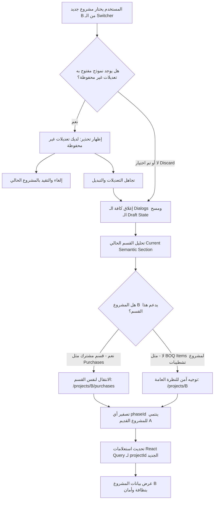
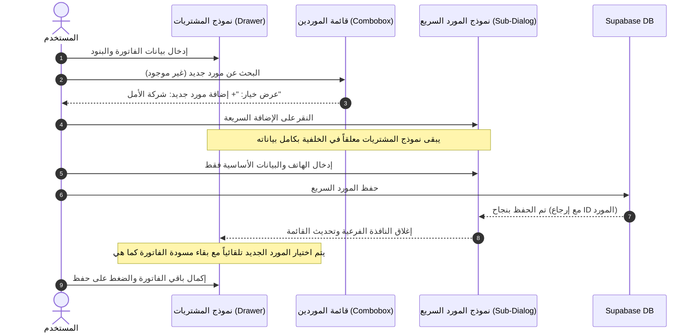
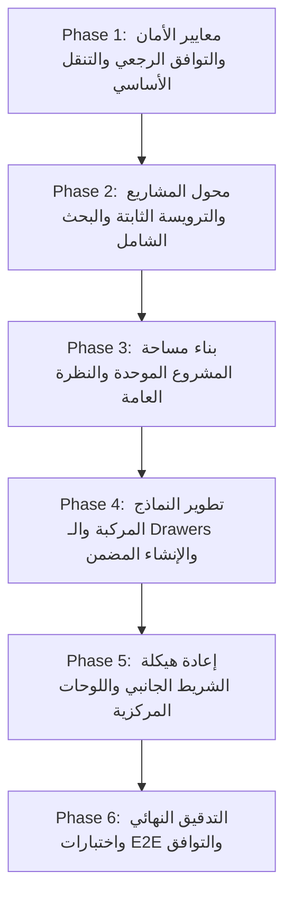

# الخطة المعمارية الشاملة لإعادة بناء تجربة الاستخدام والمسارات (UX / UI Rebuild Master Plan)
## منظومة ركاز / الفارس الذهبي لإدارة المقاولات والتشطيبات

> **طبيعة الوثيقة:** وثيقة قرارات معمارية ملزمة وهندسة تفصيلية لتجربة الاستخدام (Architecture Decision Record & Master Plan).  
> **المرجع الأساسي:** تقرير التدقيق الشامل [`docs/ux-ui-navigation-audit.md`](file:///e:/ركاز/docs/ux-ui-navigation-audit.md).  
> **حالة النظام المالي:** **النظام المالي معتمد ومحصن بالكامل (Financial System Rebuild = Complete & Verified)**. لا يجوز لأي تبسيط في تجربة المستخدم المساس بالقواعد المحاسبية أو دمج العمليات المستقلة في قاعدة البيانات.

---

## فهرس الوثيقة

1. [الفلسفة الجوهرية لتجربة الاستخدام (Core UX Philosophy)](#1-core-ux-philosophy)
2. [هيكل المعلومات النهائي (Final Information Architecture)](#2-final-information-architecture)
3. [هندسة الشريط الجانبي النهائية وتصنيف الـ 29 شاشة (Sidebar Architecture)](#3-sidebar-architecture)
4. [هندسة مساحة عمل المشروع والمقارنة المعمارية (Project Workspace Architecture)](#4-project-workspace-architecture)
5. [قواعد مساحة العمل بين مشاريع المقاولات والتشطيبات (Contracting vs Finishing Rules)](#5-contracting-vs-finishing-rules)
6. [هندسة التنقل بين المراحل والفواتير (Phase-Level Navigation Architecture)](#6-phase-level-navigation-architecture)
7. [مواصفات ترويسة المشروع الثابتة (Project Header Specification)](#7-project-header-specification)
8. [خوارزمية محول المشاريع السريع (Project Switcher Algorithm)](#8-project-switcher-algorithm)
9. [أمان النماذج والبيانات غير المحفوظة أثناء تبديل المشروع (Unsaved Changes & State Safety)](#9-unsaved-changes--state-safety)
10. [مواصفات البحث الشامل ولوحة الأوامر (Global Search / Command Palette)](#10-global-search--command-palette)
11. [نموذج الأمان لزر الإنشاء السريع العام (Global Quick Create Safety Model)](#11-global-quick-create-safety-model)
12. [نموذج الإنشاء السريع داخل مساحة المشروع (Project Quick Create Rules)](#12-project-quick-create-rules)
13. [قواعد الحماية الصارمة من العمل على المشروع الخاطئ (Wrong-Project Prevention)](#13-wrong-project-prevention)
14. [معمارية الإنشاء المضمن للكيانات (Nested / In-Flight Entity Creation)](#14-nested-in-flight-entity-creation)
15. [مصفوفة أسطح النماذج (Form Surface Decision Matrix: Modal vs Drawer vs Page)](#15-form-surface-decision-matrix)
16. [مواصفات مسار عمل فاتورة المشتريات (Purchase Workflow Specification)](#16-purchase-workflow-specification)
17. [مواصفات تجربة المدفوعات والقبض والصرف (Payment UX Specification)](#17-payment-ux-specification)
18. [نمط المعاينة المالية الفورية للأثر (Before / After Financial Preview Pattern)](#18-before--after-financial-preview-pattern)
19. [استراتيجية أزرار الرجوع وفتات الخبز (Back & Breadcrumb Strategy)](#19-back--breadcrumb-strategy)
20. [استراتيجية حفظ حالة القوائم والفلاتر (List State Preservation Strategy)](#20-list-state-preservation-strategy)
21. [مصفوفة ترحيل المسارات والتوافق الرجعي (Route Migration Matrix)](#21-route-migration-matrix)
22. [استراتيجية أمان React Query والذاكرة المؤقتة (React Query & State Safety)](#22-react-query--state-safety)
23. [قواعد تجربة الاستخدام حسب الأدوار والصلاحيات (Role-Based UX Rules)](#23-role-based-ux-rules)
24. [استراتيجية التجاوب مع مختلف الشاشات (Responsive Navigation Strategy)](#24-responsive-navigation-strategy)
25. [قواعد الاتجاه العربي والتصميم (RTL & Zero-Emoji Rules)](#25-rtl--zero-emoji-rules)
26. [معايير إمكانية الوصول والتنقل السريع (Accessibility Baseline)](#26-accessibility-baseline)
27. [ميزانية النقرات المعيارية (Click Budget & Efficiency Targets)](#27-click-budget--efficiency-targets)
28. [معايير القبول الصارمة لتجربة المستخدم (UX Acceptance Criteria)](#28-ux-acceptance-criteria)
29. [خريطة الاعتماديات التقنية (Implementation Dependencies Graph)](#29-implementation-dependencies-graph)
30. [مراحل التنفيذ المرتبة والمفصلة (Ordered UX Rebuild Phases)](#30-ordered-ux-rebuild-phases)

---

## 1. Core UX Philosophy

### ما هو مركز النظام؟
المركز المعماري الحقيقي لمنظومة ركاز هو **Project-Centric Workflow** مدعوماً بشاشات **Global Oversight & Shared Directories** وفق حدود فاصلة وواضحة (Strictly Delineated Hybrid Model):

1. **مساحات العمل الأساسية (Primary Workspaces):**  
   - مساحة المشروع (`/projects/:id/...`): هي موطن تنفيذ العمليات التشغيلية اليومية (بنود المقايسة، فواتير المشتريات، إنجاز الفنيين، إيجارات المعدات، مصروفات الموقع، تسديدات الزبون على مستوى المشروع، والعقود).
2. **الأدلة المركزية المشتركة (Secondary Directories):**  
   - أدلة الأشخاص والشركاء (العملاء، الموردون، الفنيون، المهندسون، الموظفون، المعدات). وظيفتها: سجلات تعريفية، كشوفات حساب تاريخية شاملة (Ledgers)، وتجميع الحركات عبر كافة المشاريع.
3. **شاشات الرقابة والإدارة المالية (Control & Oversight Screens):**  
   - مركز الخزائن والتحويلات، مركز الفواتير ومطابقة الذمم، ديون الزبائن، والتقارير المالية والضريبية العامة. وظيفتها: الرقابة، التدقيق، الموازنة، ومطابقة الأرصدة.

### مصفوفة تصنيف الكيانات والوظائف (Feature Classification Matrix)

| الكيان / الوظيفة | الموطن الأساسي (Primary Home) | العرض الثانوي (Secondary View) | هل يُنشأ هنا؟ (Can Create?) | هل يُعدل هنا؟ (Can Edit?) | النطاق (Scope) | الأساس المنطقي المعماري |
|---|---|---|---|---|---|---|
| **Projects (المشاريع)** | `Projects.tsx` (قائمة المشاريع) | `Dashboard.tsx` (بطاقات المشاريع) | نعم (صفحة إنشاء جديدة) | نعم (داخل إعدادات المشروع) | Global | المشروع هو الحاوية التنفيذية الكبرى لكافة التكاليف والإيرادات. |
| **Contracts (العقود)** | مساحة المشروع (`ProjectContracts.tsx`) | دليل العقود العام (`Contracts.tsx`) | نعم (داخل المشروع والعام) | نعم | Project-First | العقد التنفيذي يتبع مشروعاً وعميلاً محدداً، بينما العام يعرض إجمالي التعاقدات. |
| **BOQ Items (بنود المقايسة)** | مساحة المشروع (`ProjectItems.tsx`) | قوالب البنود العامة (`GeneralItems.tsx`) | نعم (داخل المشروع) | نعم | Project-Only | البند مرتبط بمقايسة وحساب كميات لمشروع معين. |
| **Phases (فواتير المراحل)** | مساحة المشروع (`ProjectPhases.tsx`) | — | نعم (داخل المشروع) | نعم | Project-Only | المرحلة تقسيم زمني وتنفيذي لمشروع بعينه. |
| **Purchases (المشتريات)** | مساحة المشروع (`ProjectPurchases.tsx`) | مركز الفواتير (`InvoiceControl.tsx`) | نعم (داخل المشروع فقط) | نعم (داخل المشروع) | Project-First | فاتورة الشراء تنفق من أجل بند أو مرحلة بمشروع؛ مركز الفواتير للمراجعة والفلترة. |
| **Supplier Payments (سداد المورد)** | كشف حساب المورد (`SupplierDetail.tsx`) | مساحة المشروع (عرض المشتريات) | نعم (من كشف المورد/المشروع) | نعم | Entity-Centric | سداد المورد حركة مالية تسدد فواتيره (قد تغطي فواتير من عدة مشاريع). |
| **Technician Progress (إنجاز الفني)** | مساحة المشروع (`ProjectProgress.tsx`) | كشف حساب الفني (`TechnicianDetail.tsx`) | نعم (داخل المشروع) | نعم | Project-First | الإنجاز يحدث ميدانياً على بنود المشروع. |
| **Technician Payments (سداد الفني)** | كشف حساب الفني (`TechnicianDetail.tsx`) | مساحة المشروع (المصروفات) | نعم (من كشف الفني) | نعم | Entity-Centric | صرف مستحقات العمالة يتم وفق رصيد الفني الإجمالي. |
| **Equipment (المعدات والأصول)** | دليل المعدات (`Equipment.tsx`) | — | نعم (في دليل المعدات) | نعم | Global | إدارة أصول الشركة وسجل الصيانة والمواصفات. |
| **Rentals (إيجارات المعدات)** | مساحة المشروع (`ProjectRentals.tsx`) | دليل الإيجارات (`ProjectsWithRentals.tsx`) | نعم (داخل المشروع) | نعم | Project-First | تأجير المعدة يتم لتغطية عمل في مشروع محدد. |
| **Project Expenses (مصروفات الموقع)** | مساحة المشروع (`ProjectExpenses.tsx`) | المصروفات العامة (`Expenses.tsx`) | نعم (داخل المشروع) | نعم | Project-First | المصروف النثري الميداني يخص مشروعاً ومرحلة. |
| **General Expenses (مصروفات عامة)** | المصروفات العامة (`Expenses.tsx`) | — | نعم (في المصروفات العامة) | نعم | Global | مصروفات المقر، الإيجارات الإدارية، وفواتير الشركة غير المخصصة لمشروع. |
| **Client Payments (تسديدات الزبائن)** | مساحة المشروع (`ProjectPayments.tsx`) | سجل المقبوضات (`ClientPayments.tsx`) | نعم (داخل المشروع والعميل) | نعم | Project-Level | استلام الدفعة يتم للمشروع ككل ويسجل إيداعاً في الخزينة دون أي توزيع على فواتير أو بنود. |
| **Clients (العملاء)** | دليل العملاء (`Clients.tsx`) | ملف العميل (`ClientDetail.tsx`) | نعم (في الدليل + In-flight) | نعم | Global Directory | إدارة بيانات التواصل والرقم الوطني والعنوان وكشف الحساب المجمع. |
| **Suppliers (الموردون)** | دليل الموردين (`Suppliers.tsx`) | كشف المورد (`SupplierDetail.tsx`) | نعم (في الدليل + In-flight) | نعم | Global Directory | إدارة بيانات المورد وكشف حساب فواتيره ومطابقاته. |
| **Technicians (الفنيون)** | دليل الفنيين (`Technicians.tsx`) | كشف الفني (`TechnicianDetail.tsx`) | نعم (في الدليل + In-flight) | نعم | Global Directory | إدارة طاقم العمالة وكشوفات الإنجاز والمستحقات. |
| **Treasuries (الخزائن)** | مركز الخزائن (`Treasuries.tsx`) | كشف الخزينة (`TreasuryDetail.tsx`) | نعم (في مركز الخزائن) | نعم | Global Financial | رقابة السيولة والحسابات المصرفية والنقدية للشركة. |
| **Transfers (التحويلات بين الخزائن)**| مركز الخزائن (`Treasuries.tsx`) | — | نعم (في مركز الخزائن) | لا (حركة مقيدة) | Global Financial | حركة مالية بين خزينتين (دخول وخروج متوازن). |
| **Reports (التقارير الشاملة)** | مركز التقارير (`Reports.tsx`) | تقرير المشروع (`ProjectReport.tsx`) | عرض وطباعة | — | Global / Project | تقارير مجمعة للشركة، وتقارير تفصيلية لكل مشروع. |
| **Invoice Control (مركز الفواتير)** | شاشة الرقابة (`InvoiceControl.tsx`) | — | لا (عرض وفلترة وتدقيق) | نعم (تعديل مالي) | Global Oversight | شاشة محاسبية لمراجعة الفواتير المستحقة والمدفوعة عبر كافة الموردين. |
| **Debts (ديون وذمم الزبائن)** | شاشة الذمم (`Debts.tsx`) | ملف العميل (`ClientDetail.tsx`) | لا (شاشة مجمعة) | — | Global Oversight | حصر ومتابعة ديون الزبائن المتأخرة والتحصيل. |
| **Custody (العهد المالية)** | شاشة العهد (`Custody.tsx`) | كشف العهدة (`CustodyDetail.tsx`) | نعم (في شاشة العهد) | نعم | Global Financial | إدارة عهد المهندسين والمشرفين ومطابقتها مع مصروفات المشاريع. |
| **Inventory (المخازن والمواد)** | شاشة المخازن (`Inventory.tsx`) | — | نعم (في شاشة المخازن) | نعم | Global Ops | إدارة رصيد المواد والتخزين العام قبل الصرف للمشاريع. |

---

## 2. Final Information Architecture

```mermaid
graph TD
  Root[منظومة ركاز]
  
  Root --> Header[الترويسة الموحدة Unified Header]
  Header --> H_Switcher[Project Switcher Combobox]
  Header --> H_Search[Global Command Palette - Ctrl+K]
  Header --> H_Quick[+ إضافة سريعة Quick Create]
  Header --> H_Notif[إشعارات الرقابة والنشاط]
  Header --> H_User[قائمة المستخدم والإعدادات]

  Root --> Sidebar[الشريط الجانبي المركز - 4 مجموعات واضحة]
  
  Sidebar --> G1[1. المشاريع التنفيذية Projects]
  G1 --> Nav_Contracting[مشاريع المقاولات]
  G1 --> Nav_Finishing[مشاريع التشطيبات]
  G1 --> Nav_AllProjects[كافة المشاريع والأرشيف]

  Sidebar --> G2[2. المالية والخزائن Finance]
  G2 --> Nav_Treasuries[خزائن الشركة والحسابات]
  G2 --> Nav_ClientPayments[إيصالات ومقبوضات الزبائن]
  G2 --> Nav_InvoiceControl[مركز الفواتير والذمم]
  G2 --> Nav_Expenses[المصروفات العامة والتشغيلية]

  Sidebar --> G3[3. الشركاء وفريق العمل Partners & Team]
  G3 --> Nav_Clients[دليل العملاء]
  G3 --> Nav_Suppliers[دليل الموردين]
  G3 --> Nav_Technicians[دليل الفنيين والعمالة]
  G3 --> Nav_Equipment[المعدات والآليات]
  G3 --> Nav_Team[المهندسون والموظفون]

  Sidebar --> G4[4. الرقابة والنظام System & Oversight]
  G4 --> Nav_Dashboard[لوحة التحكم والعمليات]
  G4 --> Nav_Reports[التقارير المالية والتحليلية]
  G4 --> Nav_Audit[سجل الرقابة وتتبع التعديلات]
  G4 --> Nav_Settings[الإعدادات وقوالب الطباعة والعقود]

  Root --> ProjectSpace[مساحة عمل المشروع الواحد Unified Project Workspace]
  ProjectSpace --> Tab_Overview[1. نظرة عامة ومؤشرات حية Overview]
  ProjectSpace --> Tab_Phases[2. فواتير المراحل والبنود Phases & BOQ]
  ProjectSpace --> Tab_Purchases[3. المشتريات والخدمات Purchases]
  ProjectSpace --> Tab_Labor[4. العمالة والفنيين Labor & Progress]
  ProjectSpace --> Tab_Rentals[5. المعدات واللوجستيات Equipment]
  ProjectSpace --> Tab_Expenses[6. المصروفات النثرية Expenses]
  ProjectSpace --> Tab_Payments[7. تسديدات الزبون والعقود Payments & Contracts]
  ProjectSpace --> Tab_Reports[8. التقارير والطباعة Reports & Print]
```



---

## 3. Sidebar Architecture

تم تقييم الـ 29 عنصراً الحالية وتوزيعها وفق مصفوفة التردد والوظيفة (Frequency & Domain Hierarchy) لتقليص التشتت دون إخفاء أي وظيفة:

| العنصر الحالي في الشريط الجانبي | مساره الحالي | القرار المعماري | الموضع النهائي | التبرير |
|---|---|---|---|---|
| **لوحة التحكم** | `/` | **KEEP PRIMARY** | مجموعة الرقابة والنظام | شاشة النظرة العامة اليومية. |
| **لوحة التحكم المالية** | `/accountant` | **GROUP UNDER PARENT** | دمج الرؤية مع لوحة التحكم أو الخزائن حسب الصلاحية | تظهر كـ View مالي للمحاسب دون تكرار بندين للوحة التحكم. |
| **مشاريع المقاولات** | `/projects/contracting` | **KEEP PRIMARY** | مجموعة المشاريع التنفيذية | وصول مباشر بنقرة واحدة للمشاريع الأساسية. |
| **مشاريع التشطيبات** | `/projects/finishing` | **KEEP PRIMARY** | مجموعة المشاريع التنفيذية | وصول مباشر لمشاريع النسبة المئوية. |
| **سجل حركات الزبائن** | `/client-activities` | **GROUP UNDER PARENT** | داخل دليل العملاء (`/clients`) | كشف تاريخي يتبع العملاء وليس عنصراً مستقلاً في الصفحة الأولى. |
| **البنود العامة** | `/general-items` | **MOVE TO SETTINGS** | الإعدادات -> قوالب البنود والمقايسات | إعدادات مرجعية وقوالب تُستخدم عند الاستيراد فقط. |
| **المعدات** | `/equipment` | **KEEP AS GLOBAL DIRECTORY**| مجموعة الشركاء وفريق العمل | دليل ومخزون أصول ومعدات الشركة. |
| **إيجارات المشاريع** | `/rentals` | **MOVE INSIDE PROJECT** | داخل مساحة المشروع + فلتر في دليل المعدات | الإيجار عملية تخص مشروعاً ومعدة؛ لا داعي لبند مستقل بالشريط. |
| **المخازن** | `/inventory` | **GROUP UNDER PARENT** | مجموعة الشركاء والعمليات | سجل حركة المواد المركزية. |
| **العملاء** | `/clients` | **KEEP AS GLOBAL DIRECTORY**| مجموعة الشركاء وفريق العمل | دليل العملاء الشامل. |
| **الموردون** | `/suppliers` | **KEEP AS GLOBAL DIRECTORY**| مجموعة الشركاء وفريق العمل | دليل الموردين وكشوفات الحساب. |
| **الفنيون** | `/technicians` | **KEEP AS GLOBAL DIRECTORY**| مجموعة الشركاء وفريق العمل | دليل الفنيين ومستحقاتهم. |
| **المهندسون** | `/engineers` | **GROUP UNDER PARENT** | دمج تحت "المهندسون والموظفون" (`/employees`) | توحيد إدارة الكادر البشري في شاشة موحدة بتبويبات. |
| **الموظفين** | `/employees` | **KEEP AS GLOBAL DIRECTORY**| مجموعة الشركاء وفريق العمل ("فريق العمل") | يشمل الموظفين والمهندسين والرواتب. |
| **مصروفات المشاريع** | `/project-expenses` | **MOVE INSIDE PROJECT** | داخل مساحة المشروع + مدمج في المصروفات | إدخال المصروف مكانه المشروع، والرقابة في شاشة المصروفات. |
| **مركز الفواتير** | `/invoice-control` | **KEEP PRIMARY** | مجموعة المالية والخزائن | الرقابة المحاسبية على الفواتير ومطابقة الموردين. |
| **خزائن الشركة** | `/treasuries` | **KEEP PRIMARY** | مجموعة المالية والخزائن | إدارة النقدية والبنوك والسيولة. |
| **إيصالات مقبوضات الزبائن** | `/client-payments` | **KEEP PRIMARY** | مجموعة المالية والخزائن | سجل الإيرادات ومطابقة دفعات العقود. |
| **ديون وذمم الزبائن** | `/debts` | **GROUP UNDER PARENT** | تبويب داخل "مركز الفواتير والذمم" أو العملاء | شاشة تجميعية تتبع تحصيل الذمم. |
| **الدخول والخروج** | `/transfers` | **REMOVE DUPLICATE ENTRY** | دمج كتابع لمركز الخزائن (`/treasuries`) | التحويلات هي جزء لا يتجزأ من إدارة الخزائن. |
| **الخروج** | `/expenses` | **KEEP PRIMARY** (إعادة تسمية) | مجموعة المالية ("المصروفات العامة") | استبدال الاسم المبهم "الخروج" بـ "المصروفات العامة". |
| **التقارير** | `/reports` | **KEEP PRIMARY** | مجموعة الرقابة والنظام | مركز التقارير والطباعة الشاملة. |
| **النسخ الاحتياطي** | `/database-backup` | **MOVE TO SETTINGS** | الإعدادات -> النسخ والأمان | وظيفة صيانة نظام تُفتح من الإعدادات. |
| **سجل التعديلات** | `/audit-log` | **KEEP PRIMARY** | مجموعة الرقابة والنظام | تدقيق الأمان والعمليات (مهم جداً للمدير). |
| **المستخدمون** | `/users` | **MOVE TO SETTINGS** | الإعدادات -> إدارة المستخدمين | إدارة أمنية وإعدادات صلاحيات. |
| **التقويم** | `/calendar` | **GROUP UNDER PARENT** | داخل لوحة التحكم كأداة تخطيط | متابعة المواعيد وتسليم المراحل. |
| **الإعدادات** | `/settings` | **KEEP PRIMARY** | مجموعة الرقابة والنظام | إعدادات الشركة، الخزائن الافتراضية، والشعار. |
| **تصميم الطباعة** | `/print-design` | **MOVE TO SETTINGS** | الإعدادات -> قوالب وتصميم الطباعة | إعداد مظهر الترويسة والفوتر والهوامش. |
| **قوالب العقود** | `/contract-templates` | **MOVE TO SETTINGS** | الإعدادات -> قوالب بنود العقود | صياغة الشروط العامة قبل ربطها بالمشاريع. |

### الهيكل النهائي للشريط الجانبي (4 مجموعات مكثفة):
```
[الشريط الجانبي النهائي المعتمد]
├── 1. المشاريع التنفيذية (Projects Hub)
│   ├── مشاريع المقاولات (/projects/contracting)
│   ├── مشاريع التشطيبات (/projects/finishing)
│   └── كافة المشاريع والأرشيف (/projects)
├── 2. المالية والخزائن (Finance & Treasury)
│   ├── خزائن الشركة والحسابات (/treasuries)
│   ├── إيصالات ومقبوضات الزبائن (/client-payments)
│   ├── مركز الفواتير والذمم (/invoice-control)
│   └── المصروفات العامة والتشغيلية (/expenses)
├── 3. الشركاء وفريق العمل (Partners & Team)
│   ├── دليل العملاء (/clients)
│   ├── دليل الموردين (/suppliers)
│   ├── دليل الفنيين والعمالة (/technicians)
│   ├── المعدات والآليات (/equipment)
│   └── فريق العمل والموظفون (/employees)
└── 4. الرقابة والنظام (Oversight & System)
    ├── لوحة التحكم الرئيسية (/)
    ├── مركز التقارير والتحليلات (/reports)
    ├── سجل الرقابة والتدقيق (/audit-log)
    └── الإعدادات العامة للمنظومة (/settings)
```

---

## 4. Project Workspace Architecture

### المقارنة المعمارية بين الخيارات الثلاثة:

| معيار المقارنة | الخيار A: 8 تبويبات مباشرة (8 Direct Tabs) | الخيار B: 6 تبويبات مجمعة (6 Grouped Tabs) | الخيار C: الهيكل الهجين المتخصص (Hybrid Workspace) [المعتمد] |
|---|---|---|---|
| **الوصول اليومي (Daily Accessibility)** | مباشر بنقرة واحدة لكل قسم، ولكن التبويبات مزدحمة. | يتطلب نقرتين (فتح التبويب الرئيسي ثم الفرعي). | **مباشر بنقرة واحدة** لأهم العمليات اليومية (المراحل، المشتريات، الفنيين) مع دمج العمليات المتشابهة. |
| **عدد النقرات (Click Count)** | 1 نقرة لكل صفحة. | 2 نقرة (Dropdown/Sub-tabs). | **1 نقرة ثابتة** للأقسام اليومية. |
| **قابلية الاستخدام على شاشات 1366px** | سيئة (فيضان التبويبات واختفاؤها في Dropdown). | ممتازة ومريحة. | **ممتازة** عبر شريط Scroll أفقي أنيق بمؤشرات واضحة. |
| **الحمل الذهني (Mental Load)** | متوسط إلى عالي لكثرة الخيارات المفتوحة. | عالي بسبب إخفاء البنود تحت مسميات عامة ("Costs"). | **منخفض جداً ومطابق لواقع المقاولات**. |
| **التكيف مع الصلاحيات (Roles)** | إخفاء التبويبات المالية يترك 3 تبويبات فقط. | إخفاء تبويب التكاليف يلغي قسماً ضخماً. | **تكيف انسيابي**؛ المهندس يرى التبويبات الميدانية، والمحاسب يرى الكل. |
| **الربط المباشر (Deep-linking)** | ممتاز (لكل قسم Route صريح). | معقد لوجود Sub-tabs داخلية. | **مثالي**: كل قسم له URL مستقل ودائم. |
| **القرار المعماري النهائي** | غير معتمد بصورته المجردة. | غير معتمد لإخفائه العمليات اليومية. | **✅ معتمد نهائياً كمعمارية موحدة للنظام**. |

### المعمارية المعتمدة لمساحة المشروع (The Final Chosen Architecture):

```
/projects/:id (Project Workspace)
├── 1. Overview (نظرة عامة ومؤشرات حية)         -> /projects/:id
├── 2. Phases & BOQ (فواتير المراحل والبنود)     -> /projects/:id/phases
├── 3. Purchases (المشتريات والخدمات)            -> /projects/:id/purchases
├── 4. Labor & Progress (العمالة والإنجاز)       -> /projects/:id/labor
├── 5. Equipment (إيجارات المعدات والآليات)      -> /projects/:id/equipment
├── 6. Expenses (مصروفات المشروع النثرية)        -> /projects/:id/expenses
├── 7. Client & Contracts (تسديدات الزبون والعقود)-> /projects/:id/billing
└── 8. Reports (التقرير المالي والطباعة)         -> /projects/:id/report
```

---

## 5. Contracting vs Finishing Rules

| المحور المعماري | مشاريع المقاولات (Contracting Projects) | مشاريع التشطيبات (Finishing Projects) |
|---|---|---|
| **فلسفة التكلفة والإيراد** | قائمة على **البنود الفردية وجداول الكميات (BOQ Items)** أو العقود المعتمدة. | قائمة على **التكلفة الفعلية المباشرة المعتمدة (مواد، خدمات، أعمال فنيين، إيجارات معدات، مصروفات مباشرة) + نسبة إدارة الشركة (%)**. |
| **تبويب البنود والمقايسات (BOQ Items)** | **ظاهر وأساسي جداً** (يحتوي حاسبة القياسات والتكعيب والأسعار). | **مخفي تماماً** (لا توجد بنود تعاقدية مفردة؛ يتم الاعتماد على فواتير الشراء والخدمات وإنجاز الفنيين). |
| **حساب مستحقات الشركة** | مجموع `contracts.amount` (أو `total_price` لكافة بنود المقاولات المنجزة كبديل). | `قاعدة التكلفة المباشرة المعتمدة (مواد + خدمات + فنيين + معدات + مصروفات مباشرة) + عمولة إدارة التشطيبات (%)` المحتسبة مركزياً عبر `financialCore`. |
| **الخزينة الافتراضية** | ترتبط بـ نطاق خزائن المقاولات وفروعها المعتمدة. | ترتبط بـ نطاق خزائن التشطيبات وفروعها المعتمدة. |
| **التبويبات الظاهرة في مساحة العمل** | يظهر تبويب `Phases & BOQ` بكامل تفاصيل المقايسة. | يظهر تبويب `Phases` تحت مسمى `فواتير المراحل والنسبة` مع تثبيت حقل النسبة. |

---

## 6. Phase-Level Navigation Architecture

### القرار المعماري:
- **المرحلة (Phase) هي أداة تصنيف وتجميع داخل مساحة المشروع وليست نظام مسارات منفصل بالكامل.**
- **النموذج المعتمد:**
  1. المسار الأساسي للأقسام يظل على مستوى المشروع: `/projects/:id/purchases`.
  2. يتم توفير **شريط تصفية واختيار للمراحل (In-Page Phase Selector)** أعلى كل جدول (مشتريات، بنود، عمالة، مصروفات) يتيح:
     - `عرض كافة المراحل (All Phases)`
     - `المرحلة 1: أعمال الحفر والتأسيس`
     - `المرحلة 2: الخرسانة المسلحة`
  3. لدعم الروابط المباشرة والطباعة المحددة لمرحلة معينة، يدعم النظام المعلمة الاختيارية `?phaseId=xxx` داخل نفس المسار (مثال: `/projects/:id/purchases?phase=PHASE_ID`) بدلاً من تكرار 6 مسارات فرعية منفصلة.

---

## 7. Project Header Specification

### العناصر الثابتة (Sticky Elements) في رأس المشروع:
1. **الجانب الأيمن:**
   - اسم المشروع (بخط عريض وواضح).
   - كود/رقم المشروع المرجعي (`REF-XXXX`).
   - اسم العميل (رابط سريع قابل للنقر يفتح ملف العميل).
   - شارة نوع المشروع (`مقاولات` أو `تشطيبات`).
   - شارة الحالة الحالية (`نشط`، `قيد الانتظار`، `مكتمل`).
2. **الجانب الأوسط (المؤشرات والنسب المحددة بدقة):**
   - **نسبة الإنجاز التنفيذي (Execution Progress %):** تحسب من متوسط إنجاز البنود والمراحل الميدانية.
   - **نسبة التحصيل المالي (Payment Collection %):** `(المقبوض من الزبون / إجمالي المستحق) × 100`.
   - *ممنوع منعاً باتاً استخدام مسمى مبهم مثل "نسبة المشروع".*
3. **الجانب الأيسر:**
   - **محول المشاريع السريع (Project Switcher).**
   - **زر الإضافة السريعة داخل المشروع (`+ إضافة بالمشروع`).**
   - **زر طباعة التقرير الشامل (`طباعة`).**

---

## 8. Project Switcher Algorithm



### جدول حالات التبديل وتوافق المسارات (Switching Route Matrix):

| المسار الحالي في المشروع A | نوع المشروع A | نوع المشروع B المستهدف | المسار المستهدف في المشروع B | التبرير المنطقي |
|---|---|---|---|---|
| `/projects/A/purchases` | Contracting | Contracting | `/projects/B/purchases` | الحفاظ على نفس القسم التشغيلي بدقة. |
| `/projects/A/purchases` | Contracting | Finishing | `/projects/B/purchases` | المشتريات مدعومة في كلا النوعين. |
| `/projects/A/phases/PH-1/items` | Contracting | Contracting | `/projects/B/phases` | إلغاء `PH-1` لأنه خاص بـ A وتوجيه لصفحة المراحل في B. |
| `/projects/A/phases/PH-1/items` | Contracting | Finishing | `/projects/B` (Overview) | مشاريع التشطيبات لا تحتوي بنود مقاولات؛ التوجيه للنظرة العامة. |
| `/projects/A/billing` | Contracting | Finishing | `/projects/B/billing` | قسم الدفعات والفواتير مشترك في كافة الأنواع. |
| `/projects/A/expenses` | Finishing | Contracting | `/projects/B/expenses` | قسم المصروفات مشترك. |

---

## 9. Unsaved Changes & State Safety

### القواعد الصارمة لإدارة النماذج غير المحفوظة:
1. **تتبع حالة التغيير (Dirty State Tracking):** يستخدم النظام `formState.isDirty` من React Hook Form.
2. **منع الإغلاق الصامت:**
   - النقر على الخلفية المعتمة (Backdrop Click): **معطل افتراضياً** أثناء وجود `isDirty = true`.
   - ضغط مفتاح `Escape`: يظهر تأكيد تنبيهي: *"توجد بيانات غير محفوظة، هل تريد الإغلاق وتجاهل التعديلات؟"*
   - تبديل المشروع من الـ Switcher: يمنع التنقل ويظهر نافذة تأكيد صريحة: *(البقاء في المشروع / تجاهل التعديلات والتبديل)*.
3. **تصفير الحالة بعد الإغلاق أو التبديل:**
   - يتم تصفير كائنات الـ State المحلية بالكامل لضمان عدم تسريب أي `project_id` أو `phase_id` أو `supplier_id` قديم إلى العملية الجديدة.

---

## 10. Global Search / Command Palette

### الفصل المعماري بين البحث العام ومحول المشاريع:

| الخاصية | محول المشاريع (Project Switcher) | البحث العام ولوحة الأوامر (Command Palette) |
|---|---|---|
| **الهدف الأساسي** | تبديل سياق مساحة العمل الحالية بين المشاريع. | البحث الشامل السريع والتنقل المباشر لأي سجل أو وظيفة في النظام. |
| **الموقع** | ترويسة مساحة المشروع + الترويسة الرئيسية. | الترويسة الرئيسية (حقل بحث حقيقي) + اختصار `Ctrl + K`. |
| **نطاق البحث (Scope)**| المشاريع فقط (الاسم، الكود، اسم العميل، النوع). | المشاريع، العملاء، الموردون، الفنيون، أرقام الفواتير، الخزائن، والصفحات. |
| **شكل النتائج** | قائمة منسدلة بمشاريع مصنفة (أحدث 5 مشاريع + نتائج البحث). | نافذة Command Palette تعرض نتائج مجمعة حسب الفئة مع اختصارات لوحة المفاتيح. |
| **سلوك النقر** | تبديل سياق المشروع المفتوح فوراً مع الحفاظ على التبويب. | فتح صفحة تفاصيل السجل المختار مباشرة. |

---

## 11. Global Quick Create Safety Model

### قواعد الأمان المالي لزر الإنشاء السريع العام:

| الإجراء السريع | هل يصلح أن يكون عاماً؟ | هل يتطلب اختيار مشروع؟ | هل يتطلب اختيار خزينة؟ | مستوى المخاطرة | السلوك المعماري الإلزامي لمنع الخطأ |
|---|---|---|---|---|---|
| **+ فاتورة مشتريات** | نعم | **نعم (إلزامي)** | نعم (إذا كانت مسددة) | **عالي** | إظهار حقل بحث المشروع مع اسم العميل بوضوح؛ لا يتم الحفظ دون اختيار مشروع صريح. |
| **+ دفعة زبون** | نعم | **نعم (إلزامي)** | **نعم (إلزامي)** | **حرج** | اختيار العميل ثم المشروع؛ اختيار الخزينة مع عرض رصيدها اللحظي واسمها. |
| **+ مصروف نثري** | نعم | اختياري (عام أو لمشروع) | **نعم (إلزامي)** | **متوسط** | إبراز نوع المصروف (عام للشركة / خاص بمشروع محدد) مع بيان الخزينة المنفقة. |
| **+ إنجاز فني** | نعم | **نعم (إلزامي)** | لا | **منخفض** | اختيار المشروع ثم البند المنفذ ثم الفني القائم بالعمل. |

> **قاعدة مالية غير قابلة للتفاوض:**  
> يُمنع منعاً باتاً الاختيار الصامت للخزينة. إذا تم تحديد خزينة افتراضية، يجب عرضها بوضوح:  
> `الخزينة المحددة: الخزينة الرئيسية (الرصيد المتاح: 45,000 د.ل)` مع إمكانية التغيير قبل الحفظ.

---

## 12. Project Quick Create Rules

عندما ينقر المستخدم على زر `+ إضافة` داخل مشروع معين:
1. **تثبيت سياق المشروع (Visible & Locked Context):**  
   يظهر اسم المشروع والعميل في رأس النموذج كحقل **مرئي ومقفل (Read-only Highlighted Badge)** مثل:  
   `المشروع: فيلا حي الأندلس | العميل: الحاج مفتاح | النوع: مقاولات`
2. **منع الالتباس:** لا تظهر قائمة منسدلة لاختيار المشروع داخل مساحة المشروع، لمنع المستخدم من اختيار مشروع آخر بالخطأ أثناء عمله داخل المشروع الحالي.

---

## 13. Wrong-Project Prevention

1. **التمييز البصري الكامل:** في جميع القوائم المنسدلة والـ Comboboxes، تُعرض المشاريع بالصيغة الثلاثية:  
   `[كود المشروع] اسم المشروع — العميل: (اسم العميل) [شارة النوع]`
2. **شريط السياق الدائم (Persistent Context Indicator):** إبراز اسم المشروع النشط دائماً في الترويسة العلوية بخلفية مميزة ولون يمنع نسيان المشروع المفتوح.
3. **تأكيد العمليات المالية الحساسة:** عند تسجيل دفعة بمبلغ كبير أو حذف قيد، يذكر مربع التأكيد اسم المشروع صراحة:  
   *"أنت على وشك تسجيل دفعة بقيمة 20,000 د.ل لصالح مشروع: فيلا حي الأندلس، هل تريد المتابعة؟"*

---

## 14. Nested / In-Flight Entity Creation

### معمارية الإنشاء المضمن دون فقدان مسودة العمل:



### الحقول الدنيا للإنشاء السريع (Minimal In-Flight Forms):
- **مورد سريع (Quick Supplier):** الاسم الكامل (إلزامي)، رقم الهاتف (اختياري)، التصنيف (مورد مواد / مقاول خدمات).
- **فني سريع (Quick Technician):** الاسم الكامل (إلزامي)، رقم الهاتف (اختياري)، التخصص (كهرباء، سباكة، بناء).
- **عميل سريع (Quick Client):** الاسم الكامل (إلزامي)، رقم الهاتف (إلزامي)، المدينة (اختياري).
- *(تُستكمل باقي البيانات التفصيلية مثل الحسابات المصرفية والسجل التجاري لاحقاً من كشف الحساب).*

---

## 15. Form Surface Decision Matrix

| النموذج / العملية | الحقول والتعقيد | هل يحتوي جداول داخلية؟ | هل يحتاج معاينة طباعة؟ | السطح الحالي | السطح النهائي المعتمد | التبرير المعماري |
|---|---|---|---|---|---|---|
| **فاتورة مشتريات (Purchase Invoice)** | مورد، تاريخ، رقم فاتورة، بنود متعددة، خزينة، دفع جزئي | **نعم (جدول بنود وأسعار)** | نعم (سند صرف) | Dialog ضيق | **Slide-over Drawer (65vw)** | نموذج تشغيلي مركب يحتاج مساحة أفقية مريحة لإدخال البنود والكميات دون خنق بصري. |
| **قبض دفعة من الزبون (Project-Level Client Receipt)** | مشروع، عميل، مبلغ، خزينة، طريقة دفع، تاريخ، إيصال، ملاحظات، ومعاينة الرصيد والخزينة | لا (تسديد على مستوى المشروع بدون جداول فواتير) | نعم (إيصال قبض) | Dialog ضيق | **Standard Dialog / Focused Modal** | نموذج مالي مركز ومباشر: تسديد فوري على المشروع بدون جداول تخصيص فواتير، مع معاينة لحظية للمتبقي وأثر الخزينة. |
| **سداد مورد (Supplier Payment)** | مورد، مبلغ، خزينة، طريقة دفع، فواتير مستهدفة | خفيف | نعم (سند صرف) | Dialog | **Standard Dialog** | عملية مالية مركزة وسريعة لا تتطلب جداول معقدة. |
| **تسجيل إنجاز فني (Labor Progress)** | فني، بند، كمية منجزة، تاريخ، ملاحظات | لا | لا | Dialog | **Standard Dialog** | نموذج إدخال كمية سريع. |
| **تسجيل مصروف نثري (Expense)** | بند، مبلغ، خزينة، مشروع/عام، بيان | لا | نعم (سند صرف) | Dialog | **Standard Dialog** | تسجيل سريع من حقول معدودة. |
| **إنشاء مشروع جديد (Project Creation)** | اسم، عميل، نوع، ميزانية، مهندس، موقع، صورة | لا | لا | Full Page | **Full Page** | خطوة تأسيسية كبرى تستحق صفحة مخصصة بتركيز كامل. |
| **إنشاء وصياغة عقد (Contract Creation)** | طرفين، بنود تعاقدية، شروط دفع، قوالب نصوص | **نعم (بنود وشروط)** | **نعم (معاينة عقد)** | Full Page | **Full Page** | محرر نصوص وبنود قانونية يحتاج كامل الشاشة. |
| **إيجار معدة (Equipment Rental)** | معدة، فترة، سائق، عداد، تكلفة يومية | لا | نعم (سند إيجار) | Dialog | **Slide-over Drawer (50vw)** | يتطلب مراجعة تواريخ الإيجار ورصيد العدادات. |

---

## 16. Purchase Workflow Specification

### فصل الشراء عن الصرف محاسبياً مع تجربة مستخدم سلسة:
1. **الجزء الأول: تسجيل الفاتورة والاستحقاق (Invoice Accrual):**
   - إدخال المورد، التاريخ، رقم الفاتورة، وبنود المواد والخدمات.
   - حساب الإجمالي والمطابقة.
2. **الجزء الثاني: خيار السداد الفوري (Optional Immediate Payment):**
   - خيار صريح: `[ ] تسجيل دفعة مسددة الآن من الخزينة`
   - في حال تفعيله: تظهر حقول الخزينة، المبلغ المسدد، ورقم الإيصال.
   - **النزاهة المحاسبية:** يقوم النظام بإنشاء قيد الفاتورة في جدول `purchases`، ثم ينشئ قيد الدفعة في جدول `purchase_payments` ويخصم من `treasuries` عبر الدوال المالية المعتمدة في النظام، دون أي دمج غير محاسبي.

---

## 17. Payment UX Specification

### خطوات إدخال الدفعات (عميل / مورد / فني):
1. **تحديد الطرف المستفيد/الدافع:** تظهر بياناته ورصيده الحالي بوضوح.
2. **تحديد المبلغ وطريقة الدفع:** (نقداً / صك مصرفي / تحويل بنكي).
3. **تحديد الخزينة:** عرض رصيد الخزينة الحالي وحالتها قبل الإدخال.
4. **شاشة الأثر المالي اللحظي:** مراجعة الأرقام قبل الضغط على تأكيد.
5. **إتاحة الطباعة الفورية بنقرة واحدة:** بعد الحفظ يظهر زر `طباعة الإيصال فوراً` دون الحاجة للبحث عنه.

---

## 18. Before / After Financial Preview Pattern

نمط موحد يُطبق في كافة النماذج المالية قبل الحفظ:

```
┌────────────────────────────────────────────────────────┐
│                   المعاينة المالية للعملية             │
├──────────────────────────┬─────────────────────────────┤
│ حساب المستفيد (المورد):  │ الخزينة المنفقة:            │
│  - المستحق السابق: 15,000│  - الخزينة: الخزينة الرئيسية│
│  - الدفعة الحالية:  5,000│  - الرصيد الحالي:   60,000  │
│  - المتبقي الجديد: 10,000│  - الرصيد بعد الصرف: 55,000 │
└──────────────────────────┴─────────────────────────────┘
```
- **حالة الرصيد غير الكافي:** إذا كان المبلغ المطلوب صرفه يتجاوز رصيد الخزينة المتاح، يتحول رصيد الخزينة إلى اللون الأحمر مع **تعطيل زر الحفظ** وظهور تنبيه: *"رصيد الخزينة غير كافٍ لإتمام العملية"*.

---

## 19. Back & Breadcrumb Strategy

1. **فتات الخبز (Breadcrumbs):**
   - تمثل **الهيكل الهرمي للمكان (Structural Hierarchy)**.
   - صيغة موحدة: `الرئيسية > المشاريع > [اسم العميل] > [اسم المشروع] > المشتريات`.
   - كل عنصر في فتات الخبز هو رابط حقيقي قابل للنقر.
2. **زر الرجوع (Back Button):**
   - يمثل **الرجوع للمستوى الأب المباشر (Deterministic Parent Route)** بدلاً من الاعتماد الأعمى على `navigate(-1)` التي تفشل عند الدخول المباشر.
   - مثال: في `SupplierDetail` -> زر الرجوع يعود دائماً لـ `/suppliers` مع الحفاظ على فلاتر البحث السابقة.
3. **تصحيح اتجاه الأيقونة في RTL:**
   - استخدام `<ArrowRight className="h-4 w-4" />` المشيرة لليمين بدون أي دوران.

---

## 20. List State Preservation Strategy

- **كافة الفلاتر والبحث وأرقام الصفحات تُحفظ في الـ URL SearchParams:**  
  `https://domain.com/projects?type=contracting&status=active&search=andalus&page=1`
- **الفائدة:** عند الدخول لأي مشروع ثم العودة لقائمة المشاريع، يستعيد النظام نفس حالة البحث والفلتر والصفحة دون الحاجة لإعادة كتابتها.

---

## 21. Route Migration Matrix

| المسار الحالي (Current Route) | المسار المستهدف (Target Route) | الإجراء (Action) | خطة التوافق الرجعي (Backward Compatibility) |
|---|---|---|---|
| `/projects/:id` | `/projects/:id` | **KEEP & ENHANCE** | تحويلها لشاشة نظرة عامة شاملة للمشروع (Overview Hub). |
| `/projects/:id/edit` | `/projects/:id/settings` | **REDIRECT** | إعادة توجيه `/projects/:id/edit` تلقائياً إلى `/projects/:id/settings`. |
| `/projects/:id/phases` | `/projects/:id/phases` | **KEEP** | شاشة فواتير المراحل والبنود. |
| `/projects/:id/phases/:phaseId/items` | `/projects/:id/phases?phase=:phaseId` | **REDIRECT** | دعم المسار القديم مع توجيهه للمسار الموحد المفلتر. |
| `/projects/:id/phases/:phaseId/purchases`| `/projects/:id/purchases?phase=:phaseId`| **REDIRECT** | توجيه تلقائي لنفس صفحة المشتريات مع تفعيل الفلتر. |
| `/projects/:id/phases/:phaseId/expenses` | `/projects/:id/expenses?phase=:phaseId` | **REDIRECT** | توجيه تلقائي لصفحة المصروفات مع تفعيل الفلتر. |
| `/projects/:id/phases/:phaseId/equipment`| `/projects/:id/equipment?phase=:phaseId`| **REDIRECT** | توجيه تلقائي لصفحة الإيجارات مع تفعيل الفلتر. |
| `/projects/:id/payments` | `/projects/:id/billing` | **REDIRECT** | إعادة توجيه `/payments` إلى `/billing` (تشمل الدفعات والعقود). |

---

## 22. React Query & State Safety

1. **تقييد مفاتيح الاستعلامات (Query Keys Scoping):**  
   يجب أن تتضمن كافة مفاتيح الاستعلامات الخاصة بمساحة المشروع معرّف المشروع:  
   `["project-overview", projectId]`, `["project-purchases", projectId, { phaseId }]`.
2. **سلوك الانتقال بين المشاريع:**  
   عند تبديل المشروع، يتم إلغاء الـ Queries السابقة فوراً وعرض `Skeleton` مهيكل مؤقت خاص بالمشروع الجديد، ويُمنع منعاً باتاً إبقاء بيانات المشروع القديم مرئية كـ Stale Data أثناء التحميل.

---

## 23. Role-Based UX Rules

| الدور (Role) | الصفحة الرئيسية الافتراضية | الأقسام المرئية | الأقسام المقيدة / المخفية |
|---|---|---|---|
| **مدير النظام (Admin)** | `/` (لوحة التحكم العامة) | كافة أقسام المنظومة والمشاريع والمالية والإعدادات. | لا يوجد. |
| **المحاسب (Accountant)** | `/treasuries` أو `/accountant` | المالية، الخزائن، مركز الفواتير، مقبوضات الزبائن، والتقارير. | إعدادات النظام وتعديل المستخدمين. |
| **المهندس المشرف (Engineer)** | `/projects` (مشاريعي) | مساحة المشروع (المراحل، البنود، نسب الإنجاز، المعدات، الموردين). | الأرباح التقديرية للشركة، أرصدة الخزائن، والتحويلات البنكية. |

---

## 24. Responsive Navigation Strategy

1. **شاشات سطح المكتب الكبيرة (>= 1440px):** الشريط الجانبي مفتوح بالكامل (256px)، مساحة عمل واسعة، الجداول بكامل أعمدتها.
2. **شاشات الحواسيب المحمولة (1024px - 1366px):** يتحول الشريط الجانبي لوضع الأيقونات المصغرة (Collapsed 64px) لتوفير أقصى مساحة ممكنة للجداول المالية.
3. **الأجهزة اللوحية والمحمولة (< 1024px):** يتحول الشريط الجانبي إلى قائمة منزلقة (Mobile Drawer Sheet) تفتح بزر الهامبرغر، وتتحول جداول البيانات المعقدة إلى بطاقات مكدسة (Stacked Responsive Cards).

---

## 25. RTL & Zero-Emoji Rules

1. **الالتزام المطلق بـ RTL:** جميع المكونات والحاويات والجداول تبدأ من اليمين إلى اليسار (`dir="rtl"`).
2. **حظر الأيموجي النصية نهائياً:** يُمنع استخدام الإيموجي (مثل 💰, ⚙️, 📌, ⚠️) في أي مكان، واستبدالها بأيقونات `lucide-react` ذات ألوان وأحجام قابلة للتعديل عبر CSS.
3. **الخطوط المعتمدة:** خط `Tajawal` لكافة النصوص والواجهات العربية، وخط `Manrope` للأرقام والرموز اللاتينية.

---

## 26. Accessibility Baseline

1. **تسمية الأزرار الأيقونية (Accessible Names):** كل زر يحتوي أيقونة فقط يجب أن يتضمن `aria-label` و `title` وصفي (مثل `aria-label="طباعة التقرير"`).
2. **إدارة التركيز (Focus Management):** عند إغلاق أي Drawer أو Dialog، يعود التركيز بلوحة المفاتيح تلقائياً إلى الزر الذي قام بفتحه.
3. **التباين اللوني (Color Contrast):** ضمان نسبة تباين لا تقل عن 4.5:1 للنصوص مقابل الخلفيات.

---

## 27. Click Budget & Efficiency Targets

| المهمة اليومية (Daily Task) | الحد الأقصى للنقرات المستهدف | المسار المعماري المعتمد |
|---|---|---|
| **تبديل المشروع مع البقاء في نفس القسم** | **1 نقرة** | اختيار المشروع من الـ Switcher في الترويسة. |
| **إضافة فاتورة شراء داخل المشروع الحالي** | **1 نقرة** | النقر على `+ فاتورة مشتريات` لفتح الـ Drawer فوراً. |
| **إضافة مورد جديد أثناء كتابة الفاتورة** | **2 نقرة** | النقر على `+ إضافة مورد` من القائمة -> حفظ -> العودة للفاتورة. |
| **تسجيل دفعة عميل على المشروع** | **2 نقرة** | فتح نافذة قبض الدفعة -> إدخال المبلغ والخزينة مع معاينة الأثر المالي -> حفظ وطباعة السند. |
| **العودة لقائمة المشاريع المفلترة** | **0 كتابة (1 نقرة)** | النقر على فتات الخبز أو زر الرجوع لاستعادة الفلتر فوراً. |

---

## 28. UX Acceptance Criteria

1. **معيار عدم تسريب البيانات (Zero Cross-Project Leakage):** مستحيل تقنياً وبصرياً أن يظهر بند أو مرحلة أو فاتورة تخص مشروع A أثناء تصفح مشروع B.
2. **معيار النزاهة المالية (Financial Non-regression):** اجتياز اختبارات `npm run test:financial` بنجاح بنسبة 100% بعد أي تعديل يمس واجهات الدفع والفواتير.
3. **معيار الحماية من الفقدان (Zero Accidental Data Loss):** لا يمكن إغلاق نموذج به بيانات غير محفوظة بالنقر العشوائي خارج النافذة دون ظهور تأكيد صريح.
4. **معيار سرعة التبديل:** تبديل سياق المشروع يستغرق أقل من 300ms دون إعادة تحميل كاملة للصفحة.

---

## 29. Implementation Dependencies Graph



---

## 30. Ordered UX Rebuild Phases

### المرحلة 1 (Phase 1): أساسيات الأمان والتنقل والتوافق الرجعي (Core Safety & Navigation Baseline)
- تصحيح أسهم الرجوع المعكوسة وضبط محاذاة RTL في صفحات التفاصيل.
- تطبيق سياسة منع الإغلاق العرضي للنماذج (`Unsaved Changes Guard`).
- مزامنة فلاتر القوائم والبحث مع معلمات الرابط `URL SearchParams`.
- إعداد مصفوفة التوجيهات البديلة (`Route Redirects`) لضمان عدم كسر أي روابط قديمة.

### المرحلة 2 (Phase 2): الترويسة الموحدة ومحول المشاريع والبحث الشامل (Header, Switcher & Command Palette)
- بناء ترويسة المشروع الثابتة (`Sticky Project Header`).
- تطبيق خوارزمية محول المشاريع السريع (`Project Switcher Combobox`).
- تحويل حقل البحث في الترويسة إلى `Command Palette (Ctrl + K)` حقيقي.
- إضافة زر الإجراء السريع العام (`Global Quick Action`).

### المرحلة 3 (Phase 3): مساحة عمل المشروع الموحدة والنظرة العامة (Unified Project Workspace & Overview Hub)
- بناء صفحة النظرة العامة للمشروع (`Project Overview Hub`) متضمنة المؤشرات الحية والتنبيهات.
- توحيد تبويبات المشروع في شريط تنقل متسق ومتجاوب يراعي الفروق بين المقاولات والتشطيبات.
- دمج مسارات المراحل في نظام تصفية داخلي انسيابي داخل كل صفحة.

### المرحلة 4 (Phase 4): تطوير النماذج والـ Drawers والإنشاء المضمن (Forms, Drawers & In-Flight Creation)
- تحويل نماذج المشتريات إلى `Slide-over Drawers` عريضة ومريحة، وتحديث نموذج قبض دفعات الزبائن إلى نافذة سداد مركزة ومباشرة على مستوى المشروع والخزينة.
- تطبيق قوائم الاختيار القابلة للبحث (`Searchable Comboboxes`) للعملاء والموردين والخزائن.
- تفعيل معمارية الإنشاء المضمن للموردين والفنيين والعملاء بنوافذ فرعية سريعة.
- تطبيق نمط المعاينة المالية الفورية للأثر (`Before / After Preview`).

### المرحلة 5 (Phase 5): الشريط الجانبي المركز واللوحات الشاملة (Sidebar & Global Dashboards)
- تطبيق هيكل الشريط الجانبي النهائي المكون من 4 مجموعات واضحة ومكثفة.
- تحديث لوحة التحكم الرئيسية لتركز على المهام والتنبيهات التشغيلية الحية.
- دمج وتنسيق شاشات الموظفين والمهندسين في دليل موحد.

### المرحلة 6 (Phase 6): التدقيق النهائي واختبارات تجربة المستخدم (E2E UX Audit & Financial Verification)
- تشغيل واجتياز حزمة الفحوصات المالية `npm run test:financial`.
- اختبار ميزانية النقرات (Click Budget) لكافة العمليات اليومية.
- التحقق من التجاوب التام على الشاشات من 375px حتى 1440px+.

---

## 31. Architectural Law: Complete Independence of Collections from Disbursements

1. **دفعات العملاء تخص المشروع بالكامل (Project-Level Client Receipts)**:
   - تسديد العميل يرفع مقبوضات المشروع ويقلل المتبقي على العميل ويثبت قيد إيداع في الخزينة.
   - لا يتم توزيع دفعة الزبون على الفواتير، أو الموردين، أو الفنيين، أو المصروفات.
   - تم استبعاد أي متطلب لتوزيع الدفعات محاسبياً، ونموذج القبض يركز حصراً على المشروع والخزينة.

2. **استقلال قرارات الصرف (Disbursement Freedom)**:
   - سداد الموردين أو الفنيين أو المصروفات هو قرار إداري مستقل للشركة لا يرتبط بدفعة محددة من العميل.
   - الخزينة هي مجمع النقدية الفعلي، وليست رابط تسوية بين دفعات الزبون ومصروفات الشركة.

3. **حظر التسوية التقاطعية (No Cross-Settlement)**:
   - يمنع منعاً باتاً ربط سداد الموردين أو الفنيين بقيمة متبقي العميل أو رصيد العميل.

---

## 32. Treasury Domain Matrix

| نوع المشروع (Project Type) | النطاق المالي المسموح به (Allowed Treasury Domain) | الفروع المسموحة (Allowed Branches) | الخزينة المحددة افتراضياً (Default / Preselected) | المصدر في قاعدة البيانات (Source in DB) | هل هو مفروض بقيد قاعدة بيانات؟ (Enforced in DB?) | هل هو مفروض في الواجهة؟ (Enforced in UI?) | الفجوة المعمارية المحددة (Gap Identified) |
|---|---|---|---|---|---|---|---|
| **Contracting (مقاولات)** | نطاق خزينة المقاولات العامة | الفروع التابعة (خزينة نقدية، حسابات مصرفية) | الخزينة الرئيسية للمقاولات | `treasuries.parent_id` / `name` | لا (لا يوجد Check Constraint صلب) | جزئي (اقتراح مبني على مطابقة الاسم/النوع) | غياب عمود `project_domain` صريح في جدول `treasuries` |
| **Finishing (تشطيبات)** | نطاق خزينة التشطيبات العامة | الفروع التابعة (خزينة نقدية، حسابات مصرفية) | الخزينة الرئيسية للتشطيبات | `treasuries.parent_id` / `name` | لا (لا يوجد Check Constraint صلب) | جزئي (اقتراح مبني على مطابقة الاسم/النوع) | غياب عمود `project_domain` صريح في جدول `treasuries` |

> [!NOTE]
> **قاعدة الشفافية:** `DEFAULT != SILENT`  
> الواجهة الجديدة يجب أن تعرض بوضوح اسم الخزينة المختارة ورصيدها الحالي والرصيد المتوقع بعد العملية للمستخدم، ولا يجوز تحويل النقدية في الخلفية دون تأكيد بصري صريح.

---

## 33. Overpayment Policy (Approved — FC-02 Client Credit Ledger)

- **القاعدة التجارية المعتمدة رسمياً (Confirmed Rule)**:
  - `OVERPAYMENT POLICY = APPROVED — IMPLEMENTED`
  - عند سداد العميل لمبلغ يتجاوز مستحق المشروع الحالي ($\text{Cash Receipt} > \text{Project Remaining}$):
    1. يقفل مستحق المشروع الحالي عند الصفر ($\text{Project Remaining} = 0$).
    2. يتحول الفائض بالكامل إلى **رصيد دائن متاح على مستوى العميل (`Client Available Credit`)**.
    3. يسجل المقبوض النقدي إيداعاً وحيداً في الخزينة (`Treasury IN`).
  - **إعادة استخدام الرصيد الدائن**:
    - يمكن لإدارة الشركة يدوياً تطبيق الرصيد الدائن لتسديد أي مشروع مستقبلي يتبع **نفس العميل** (مقاولات أو تشطيبات).
    - تطبيق الرصيد لا يولد أي حركة في الخزينة ($\text{Treasury Delta} = 0$).
    - يمنع التوزيع التلقائي ويحظر التطبيق عبر عملاء مختلفين.
    - الحذف والعكس محمي محاسبياً ضد الاستهلاك التابع.

---

> **حالة الوثيقة:**  
> تم اعتماد هذه الخطة وتوثيقها رسمياً في `docs/ux-ui-rebuild-master-plan.md`.  
> **المنظومة جاهزة للبدء في تنفيذ المرحلة الأولى (Phase 1) فور اعتماد المستخدم.**
